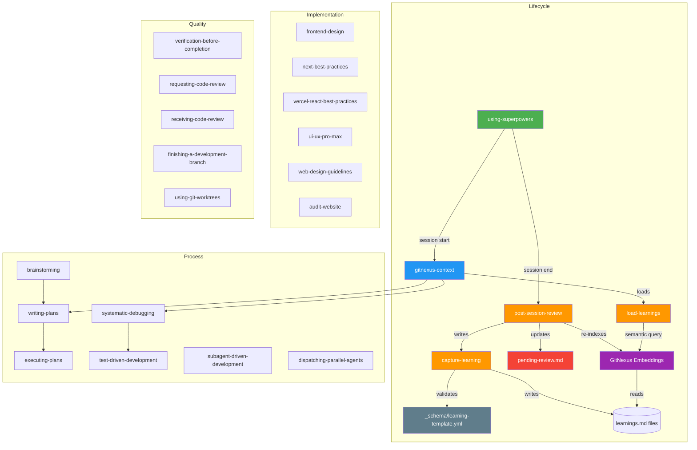

# Persistent Learning System — Implementation Plan

> **For Claude:** REQUIRED SUB-SKILL: Use superpowers:executing-plans to implement this plan task-by-task.

**Goal:** Build a self-improving memory system that captures coding learnings, prevents knowledge poisoning, and uses semantic embeddings for intelligent retrieval — reducing token consumption and eliminating repeated mistakes across sessions.

**Architecture:** Structured YAML learnings stored in per-skill `learnings.md` files, governed by three new skills (`capture-learning`, `post-session-review`, `load-learnings`), a schema file, a human review queue, and a visual skills map. The `.agents/skills/` folder is indexed with GitNexus embeddings for semantic retrieval. Confidence scoring with decay prevents poisoning. Human approval required for global promotions.

**Tech Stack:** Markdown + YAML, Mermaid diagrams, Bash, GitNexus CLI (`--skip-git --embeddings`)

---

## Dependency order

```
Task 1 (schema)
  └── Task 2 (empty learnings files + embeddings index)
        ├── Task 3 (capture-learning)     ─┐
        ├── Task 4 (post-session-review)   ├── parallel
        ├── Task 5 (load-learnings)        ├── parallel
        ├── Task 6 (pending-review.md)     ├── parallel
        └── Task 7 (SKILLS-MAP.md)        ─┘
              └── Task 8 (wire existing skills)
                    └── Task 9 (cold start seed)
                          └── Task 10 (end-to-end validation)
```

---

## Task 1 — Define the Learning Schema

**Files:**
- Create: `.agents/skills/_schema/learning-template.yml`

**Step 1: Create the schema directory**
```bash
mkdir -p ".agents/skills/_schema"
```
Expected: no error.

**Step 2: Create the schema file**

Create `.agents/skills/_schema/learning-template.yml` with this exact content:

```yaml
# ============================================================
# LEARNING SCHEMA v1.0
# Every learning in the system MUST conform to this structure.
# capture-learning validates against this before writing.
# ============================================================

# --- Required fields ---
id: "L-{skill}-{NNN}"
date: "YYYY-MM-DD"
type: ""                  # bug-fix | pattern | anti-pattern | preference | negative
status: "active"          # active | pending-review | deprecated

# --- Context fields (all required) ---
project: ""               # project name or "global"
scope: ""                 # project-specific | global
tags: []                  # 2-5 tags, lowercase, kebab-case
confidence: 1             # 1-10, starts at 1

# --- The learning (all required) ---
context: ""               # "In [technology], when [situation]..."
problem: ""               # what went wrong or was unclear
solution: ""              # what worked — actionable
reason: ""                # WHY it works — understanding not recipe

# --- Tracking ---
validated_by: []
created_in: ""

# --- Relationships (optional) ---
supersedes: null
superseded_by: null
reinforces: []
contradicts: []

# --- Decay (optional) ---
valid_until_version: {}
last_validated: "YYYY-MM-DD"
sessions_since_validation: 0

# ============================================================
# VALIDATION RULES
# 1. REJECT if context/problem/solution/reason empty
# 2. REJECT if tags < 2 or > 5
# 3. REJECT if problem/solution contains absolute file paths
# 4. REJECT if solution < 10 words
# 5. REJECT if reason is empty
# 6. WARN if type=negative and confidence > 1
# 7. CHECK tags overlap ≥ 2 with existing learnings → contradiction check
# ============================================================
```

**Step 3: Verify**
```bash
cat ".agents/skills/_schema/learning-template.yml" | head -5
```
Expected: `# LEARNING SCHEMA v1.0`

---

## Task 2 — Empty learnings files + Semantic embeddings index

**Files:**
- Create: `.agents/skills/{every-skill}/learnings.md` (19 files)
- Create: `.agents/skills/_pending/` directory

**Step 1: Create learnings.md for every existing skill**

For each skill in this list, create `.agents/skills/{skill}/learnings.md`:

Skills: `gitnexus-context`, `systematic-debugging`, `brainstorming`, `writing-plans`, `executing-plans`, `subagent-driven-development`, `verification-before-completion`, `using-superpowers`, `test-driven-development`, `finishing-a-development-branch`, `using-git-worktrees`, `requesting-code-review`, `receiving-code-review`, `dispatching-parallel-agents`, `frontend-design`, `next-best-practices`, `ui-ux-pro-max`, `audit-website`, `web-design-guidelines`

Each file has this exact content (replace `{skill}` with the skill name):

```markdown
# Learnings — {skill}

> Auto-maintained by `capture-learning` and `post-session-review`.
> Do NOT edit manually. Schema: `_schema/learning-template.yml`

<!-- LEARNINGS START -->

<!-- LEARNINGS END -->
```

**Step 2: Create the _pending directory**
```bash
mkdir -p ".agents/skills/_pending"
touch ".agents/skills/_pending/.gitkeep"
```

**Step 3: Index .agents/skills/ with GitNexus embeddings**
```bash
/Users/dan/.bun/bin/gitnexus analyze "/Users/dan/Desktop/progetti-web/Fullstack session/.agents/skills" --skip-git --embeddings 2>&1
```
Expected output:
```
Repository indexed successfully (Xs)
NNN nodes | NNN edges | NN clusters | NN flows
```
Note: first run downloads the embedding model (~250MB). Subsequent runs are fast (15-30s).

**Step 4: Verify index**
```bash
/Users/dan/.bun/bin/gitnexus list 2>&1 | grep -i "skills\|agents"
```
Expected: skills folder appears in the indexed repos list.

**Step 5: Verify all files exist**
```bash
find ".agents/skills" -name "learnings.md" | wc -l
```
Expected: 19

---

## Task 3 — Build `capture-learning` skill

**Files:**
- Create: `.agents/skills/capture-learning/SKILL.md`

**Step 1: Create directory**
```bash
mkdir -p ".agents/skills/capture-learning"
```

**Step 2: Write the skill file**

Create `.agents/skills/capture-learning/SKILL.md`:

```markdown
---
name: capture-learning
description: >
  Captures a validated learning and writes it to the correct learnings.md.
  Invoke when: a bug is resolved non-obviously, a pattern is discovered,
  the user corrects a mistake, or a solution took 2+ attempts.
  Do NOT invoke for typos, obvious errors, or one-time config.
version: 1.0.0
user-invocable: true
argument-hint: "descrivi cosa hai imparato e in quale contesto"
---

# Capture Learning

## When to invoke

- Bug resolved with non-obvious root cause
- Pattern discovered that applies beyond this case
- User corrected your approach
- Solution took 2+ attempts
- Framework/library quirk discovered

Do NOT invoke for: typos, missing imports, obvious variable errors.

## Protocol

### Step 1 — Choose target skill

| Domain | Target learnings.md |
|--------|-------------------|
| Debugging, error fixing | systematic-debugging |
| Next.js, React, App Router | next-best-practices |
| GitNexus usage | gitnexus-context |
| UI, components, styling | frontend-design |
| Session/workflow patterns | verification-before-completion |

### Step 2 — Draft learning

Fill ALL required fields:

```yaml
## Learning L-{skill}-{NNN}
id: "L-{skill}-{NNN}"
date: "{today YYYY-MM-DD}"
type: "{bug-fix|pattern|anti-pattern|preference|negative}"
status: "active"
project: "{project-name or global}"
scope: "{project-specific|global}"
tags: [{tag1}, {tag2}]
confidence: 1
context: "In [technology/version], when [specific situation]..."
problem: "{what went wrong or was unclear}"
solution: "{what worked — actionable, specific}"
reason: "{WHY this works — not just what}"
validated_by: ["{session-date}"]
created_in: "{session-date}"
supersedes: null
superseded_by: null
reinforces: []
contradicts: []
```

### Step 3 — Validate (no exceptions)

Before writing, check ALL:

1. `context`, `problem`, `solution`, `reason` are filled
2. `tags` has 2-5 items
3. `problem` and `solution` have NO absolute file paths (`/Users/...`, `src/...`)
4. `solution` is ≥ 10 words and actionable
5. `reason` explains WHY (not just what)
6. If `type: negative` → `confidence` must be 1

Fix any failures before proceeding. Do not skip.

### Step 4 — Contradiction check

```bash
# Search for learnings with ≥ 2 matching tags
grep -r "tags:" ".agents/skills/*/learnings.md" | grep "{tag1}\|{tag2}"
```

If conflict found, present to user:
```
⚠️ CONFLICT DETECTED
New:      "{summary}" [tags: ...]
Existing: L-{id} "{summary}" — confidence: N

A) New supersedes old → update supersedes/superseded_by
B) Both valid, different scope → adjust scope fields
C) Cancel
```

Wait for decision. Never auto-resolve.

### Step 5 — Write

Calculate next ID: count `## Learning` lines in target file + 1.

Append between `<!-- LEARNINGS START -->` and `<!-- LEARNINGS END -->`.

### Step 6 — Re-index skills

```bash
/Users/dan/.bun/bin/gitnexus analyze "/Users/dan/Desktop/progetti-web/Fullstack session/.agents/skills" --skip-git --embeddings 2>&1
```

This keeps the semantic index fresh after every new learning.

### Step 7 — Confirm

```
✅ Learning captured: L-{skill}-{NNN}
   Type: {type} | Confidence: 1 | Scope: {scope}
   Tags: {tags}
   File: {skill}/learnings.md
```

## Multi-agent safety

If running as a subagent, write to temp file instead:
```
.agents/skills/_pending/learning-{date}-{random}.yml
```
Parent agent merges at session end via post-session-review.
```

**Step 3: Verify skill is loadable**
```bash
head -5 ".agents/skills/capture-learning/SKILL.md"
```
Expected: `---` frontmatter start.

---

## Task 4 — Build `post-session-review` skill

**Files:**
- Create: `.agents/skills/post-session-review/SKILL.md`

**Step 1: Create directory**
```bash
mkdir -p ".agents/skills/post-session-review"
```

**Step 2: Write the skill file**

Create `.agents/skills/post-session-review/SKILL.md`:

```markdown
---
name: post-session-review
description: >
  MANDATORY at the end of every coding session. Audits for missed learnings,
  applies confidence decay, merges subagent pending files, updates pending-review.md,
  and re-indexes the skills knowledge graph.
  Triggers: "ho finito", "basta per oggi", "fine sessione", "ultimo commit",
  any signal the coding session is ending.
version: 1.0.0
user-invocable: true
argument-hint: "avvia la review di fine sessione"
---

# Post-Session Review — MANDATORY

This skill MUST run at the end of every coding session where code was written.

## Protocol

### Phase 1 — Session audit (2 min)

Look back at this session. For each YES, invoke `capture-learning`:

1. Did I make a mistake that took 2+ attempts to fix? → capture (type: bug-fix)
2. Did the user correct my approach? → capture (type: preference or anti-pattern)
3. Did I find a non-obvious solution? → capture (type: pattern)
4. Did I discover a framework/library quirk? → capture (type: bug-fix)

### Phase 2 — Merge pending subagent learnings (1 min)

```bash
ls ".agents/skills/_pending/" 2>/dev/null
```

For each `.yml` file found:
1. Read it
2. Validate against schema
3. Run contradiction check
4. If valid → append to correct `learnings.md`
5. Delete the temp file

```bash
rm -f ".agents/skills/_pending/*.yml"
```

### Phase 3 — Confidence decay

For each `learnings.md` with active learnings:

**Learnings validated this session** (used or confirmed):
- `confidence += 1` (max 10)
- `last_validated: {today}`
- `sessions_since_validation: 0`
- Add session to `validated_by`

**Learnings NOT used this session**:
- `sessions_since_validation += 1`

**Decay thresholds**:
- `sessions_since_validation >= 5` AND `confidence > 1` → `confidence -= 1`
- `sessions_since_validation >= 15` → `status: pending-review`
- `sessions_since_validation >= 30` → `status: deprecated`

### Phase 4 — Version check (30 sec)

If project has `package.json`:
```bash
grep -r "valid_until_version:" ".agents/skills/*/learnings.md"
```
For each found: compare version in learning vs current `package.json`.
If major version differs → set `status: pending-review`.

### Phase 5 — Promotion candidates (30 sec)

```bash
grep -B 20 "confidence: [4-9]\|confidence: 10" ".agents/skills/*/learnings.md" | grep "scope: project-specific"
```
For each candidate with confidence ≥ 4: check if same pattern exists in another project.
If yes → add to `pending-review.md` as promotion candidate.

### Phase 6 — Update pending-review.md

Append new items to `.agents/skills/pending-review.md`:

```markdown
## {date}

### New Learnings (confidence 1 — needs validation)
- L-{id}: "{summary}" — awaiting validation

### Promotion Candidates
- L-{id}: project-specific → global candidate (validated in N projects)

### Decay Alerts
- L-{id}: {N} sessions without validation — keep or deprecate?

### Version Conflicts
- L-{id}: version mismatch detected — update or deprecate?
```

### Phase 7 — Re-index skills with embeddings

```bash
/Users/dan/.bun/bin/gitnexus analyze "/Users/dan/Desktop/progetti-web/Fullstack session/.agents/skills" --skip-git --embeddings 2>&1
```

This keeps semantic search current after all changes made this session.

### Phase 8 — Summary

```
📋 Post-session review complete
   ✅ New learnings captured: N
   🔄 Confidence updated: N learnings
   ⏰ Decay applied: N learnings
   📤 Promotion candidates: N
   🔍 Skills index: re-indexed with embeddings
   📝 Pending review: N items (check pending-review.md when ready)
```
```

**Step 3: Verify**
```bash
head -5 ".agents/skills/post-session-review/SKILL.md"
```
Expected: `---` frontmatter start.

---

## Task 5 — Build `load-learnings` skill

**Files:**
- Create: `.agents/skills/load-learnings/SKILL.md`

**Step 1: Create directory**
```bash
mkdir -p ".agents/skills/load-learnings"
```

**Step 2: Write the skill file**

Create `.agents/skills/load-learnings/SKILL.md`:

```markdown
---
name: load-learnings
description: >
  Loads the most relevant learnings at session start using semantic search
  via GitNexus embeddings. Hard cap of 15 learnings to protect context window.
  Called automatically by gitnexus-context after loading the knowledge graph.
version: 1.0.0
user-invocable: false
---

# Load Learnings

**Hard cap: 15 learnings per session. No exceptions.**

## Protocol

### Step 1 — Semantic query

Use GitNexus to query the skills knowledge graph semantically:

```
gitnexus_query(
  query: "{current task description}",
  repo: "skills",
  limit: 30
)
```

This returns learnings semantically similar to the current task — not just tag matches.

### Step 2 — Score and filter

From the query results, score each learning:

```
score = (confidence × 2)
      + (3 if scope=global OR scope matches current project)
      + (2 if last_validated within 5 sessions)
      + (2 if skill matches active skill)
```

Then apply filters:
- EXCLUDE `status: deprecated`
- EXCLUDE project-specific learnings from OTHER projects
- SORT by score descending
- TAKE top 15

### Step 3 — Load into context

For each selected learning, load ONLY these fields (not full YAML):
- `context`
- `problem`
- `solution`
- `confidence` (as trust indicator)

Do NOT load: id, dates, tracking fields, relationships.
This keeps the context footprint minimal.

### Step 4 — Present summary

```
📚 Loaded {N} learnings for this session:
   🌐 Global ({N}): {tag summaries}
   📁 Project-specific ({N}): {project name}
   🎯 Skill-specific ({N}): {skill names}
   
   Highest confidence: L-{id} (confidence: {N})
   Most recent: L-{id} (captured {date})
```

## When to reload mid-session

- Skill domain changes significantly (debugging → UI work) → reload
- Project switches → full reload
- Do NOT reload for every small task change
```

**Step 3: Verify**
```bash
head -5 ".agents/skills/load-learnings/SKILL.md"
```

---

## Task 6 — Create pending-review.md

**Files:**
- Create: `.agents/skills/pending-review.md`

**Step 1: Write the file**

Create `.agents/skills/pending-review.md`:

```markdown
# Pending Review — Learnings

> Auto-maintained by `post-session-review`.
> Review when convenient. Tell me: **approve**, **reject**, or **edit [correction]** for each item.
> After reviewing, the item is removed from this file.

---

## How to review

Open this file and tell me which items to approve/reject.
I will apply the changes to the relevant `learnings.md` files.

---

<!-- REVIEW ITEMS START -->

No items pending review yet.

<!-- REVIEW ITEMS END -->
```

**Step 2: Verify**
```bash
cat ".agents/skills/pending-review.md" | head -5
```
Expected: `# Pending Review — Learnings`

---

## Task 7 — Build SKILLS-MAP.md

**Files:**
- Create: `.agents/skills/SKILLS-MAP.md`

**Step 1: Write the file**

Create `.agents/skills/SKILLS-MAP.md`:

```markdown
# Skills Ecosystem Map

> Auto-updated by `post-session-review`. Last update: 2026-04-10

## Skill Graph



## Skill Inventory

| Skill | Type | Learnings | Confidence avg |
|-------|------|-----------|---------------|
| using-superpowers | lifecycle | 0 | — |
| gitnexus-context | lifecycle | 0 | — |
| load-learnings | lifecycle | 0 | — |
| capture-learning | lifecycle | 0 | — |
| post-session-review | lifecycle | 0 | — |
| brainstorming | process | 0 | — |
| systematic-debugging | process | 0 | — |
| writing-plans | process | 0 | — |
| executing-plans | process | 0 | — |
| test-driven-development | process | 0 | — |
| subagent-driven-development | process | 0 | — |
| dispatching-parallel-agents | process | 0 | — |
| frontend-design | implementation | 0 | — |
| next-best-practices | implementation | 0 | — |
| vercel-react-best-practices | implementation | 0 | — |
| ui-ux-pro-max | implementation | 0 | — |
| web-design-guidelines | implementation | 0 | — |
| audit-website | implementation | 0 | — |
| verification-before-completion | quality | 0 | — |
| requesting-code-review | quality | 0 | — |
| receiving-code-review | quality | 0 | — |
| finishing-a-development-branch | quality | 0 | — |
| using-git-worktrees | quality | 0 | — |

## Learning Stats

- **Total learnings**: 0
- **Global**: 0 | **Project-specific**: 0
- **Average confidence**: —
- **Pending review**: 0
- **Deprecated**: 0
- **Semantic index**: active (embeddings enabled)
```

**Step 2: Verify**
```bash
head -5 ".agents/skills/SKILLS-MAP.md"
```
Expected: `# Skills Ecosystem Map`

---

## Task 8 — Wire into existing skills

**Files:**
- Modify: `.agents/skills/gitnexus-context/SKILL.md`
- Modify: `.agents/skills/using-superpowers/SKILL.md`

**Step 1: Update gitnexus-context**

After "Step 4 — Carica il contesto del progetto", add a new step:

```markdown
### Step 4b — Carica i learnings rilevanti

Invoke `load-learnings` now:

- Input: current project name + task description
- This uses semantic search to find the 15 most relevant past learnings
- Learnings are loaded into context as active knowledge

Without this step, past mistakes and patterns are invisible.
```

**Step 2: Update using-superpowers**

Add a "Session End Protocol" section after the existing "Session Start Protocol":

```markdown
## Session End Protocol

**At the end of every coding session**, invoke `post-session-review`.
Non-negotiable — without it, learnings are lost and decay is not tracked.

Triggers (invoke before closing):
- "ho finito" / "basta per oggi" / "fine sessione"
- "ultimo commit" / "commit finale"
- Any signal the coding session is ending

```
User ending session → post-session-review ALWAYS → then close
```
```

**Step 3: Verify both updates**
```bash
grep -c "load-learnings" ".agents/skills/gitnexus-context/SKILL.md"
grep -c "post-session-review" ".agents/skills/using-superpowers/SKILL.md"
```
Expected: both return `1`.

---

## Task 9 — Cold start seed

**Files:**
- Modify: `.agents/skills/systematic-debugging/learnings.md`
- Modify: `.agents/skills/gitnexus-context/learnings.md`
- Modify: `.agents/skills/next-best-practices/learnings.md`

**Step 1: Ask Dan for known patterns**

Before writing, ask:

```
Per il cold start ho bisogno di 3-5 pattern che conosci già.
Dimmi:
1. Bug che si ripresenta spesso nei tuoi progetti
2. Errori che gli AI fanno sul tuo stack (Next.js, Payload, Tailwind)
3. Tue preferenze di coding che devo sempre rispettare
4. Anti-pattern che hai imparato a evitare
```

**Step 2: Write seed learnings via capture-learning**

For each pattern Dan provides:
- Invoke `capture-learning` protocol
- Set `confidence: 3` (pre-validated by human, not the default 1)
- Set `created_in: "cold-start-2026-04-10"`

**Step 3: Verify seeds written**
```bash
grep -r "## Learning" ".agents/skills/*/learnings.md" | wc -l
```
Expected: 9-15 seed learnings.

**Step 4: Re-index with embeddings**
```bash
/Users/dan/.bun/bin/gitnexus analyze "/Users/dan/Desktop/progetti-web/Fullstack session/.agents/skills" --skip-git --embeddings 2>&1
```
Expected: successful re-index including new seed learnings.

---

## Task 10 — End-to-end validation

**Files:** None (read-only)

**Step 1: Verify all files exist**
```bash
echo "=== Schema ===" && test -f ".agents/skills/_schema/learning-template.yml" && echo "OK"
echo "=== Skills ===" && test -f ".agents/skills/capture-learning/SKILL.md" && echo "OK"
test -f ".agents/skills/post-session-review/SKILL.md" && echo "OK"
test -f ".agents/skills/load-learnings/SKILL.md" && echo "OK"
echo "=== Infrastructure ===" && test -f ".agents/skills/pending-review.md" && echo "OK"
test -f ".agents/skills/SKILLS-MAP.md" && echo "OK"
test -d ".agents/skills/_pending" && echo "OK"
echo "=== Learnings files ===" && find ".agents/skills" -name "learnings.md" | wc -l
echo "=== GitNexus index ===" && /Users/dan/.bun/bin/gitnexus list 2>&1 | grep -i "skills"
```
Expected: all OK, 19+ learnings files, skills folder in index.

**Step 2: Smoke test capture-learning**

Invoke `capture-learning` with a test learning:
```yaml
type: pattern
project: global
scope: global
tags: [test, validation]
context: "In the learning system, when testing capture-learning..."
problem: "No test learning existed to validate the system"
solution: "Write a test learning with valid schema fields"
reason: "System needs at least one learning to verify the full pipeline works"
```
Then verify it appears in `verification-before-completion/learnings.md`.

**Step 3: Smoke test load-learnings**

Invoke `load-learnings` with query "test validation system".
Verify: test learning appears in results, hard cap logic runs, summary is printed.

**Step 4: Smoke test post-session-review**

Invoke `post-session-review`.
Verify:
- Test learning confidence is updated
- `pending-review.md` shows the test learning (confidence: 1 = new)
- Skills index was re-indexed

**Step 5: Clean up test learning**

Remove the test learning from `verification-before-completion/learnings.md`.
Re-index:
```bash
/Users/dan/.bun/bin/gitnexus analyze "/Users/dan/Desktop/progetti-web/Fullstack session/.agents/skills" --skip-git --embeddings 2>&1
```

---

## Summary

| Task | What | Parallel? |
|------|------|-----------|
| 1 | Schema definition | No (foundation) |
| 2 | Empty files + embeddings index | After 1 |
| 3 | capture-learning skill | After 2, parallel with 4-7 |
| 4 | post-session-review skill | After 2, parallel with 3,5-7 |
| 5 | load-learnings skill | After 2, parallel with 3-4,6-7 |
| 6 | pending-review.md | After 2, parallel with 3-5,7 |
| 7 | SKILLS-MAP.md | After 2, parallel with 3-6 |
| 8 | Wire existing skills | After 3+4+5 |
| 9 | Cold start seed | After 1+2+3 |
| 10 | End-to-end validation | After all |

**Estimated time: ~25 minutes total**
