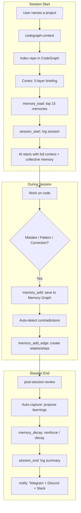

# SkillBrain

> **Your AI coding assistant forgets everything when you close the session.**  
> This fixes that — permanently.


**Built by [Daniel De Vecchi](https://www.linkedin.com/in/danieldevecchi/) · [GitHub](https://github.com/deve1993)**

---

## What Is SkillBrain?

SkillBrain is a **self-improving AI coding workspace** with 7 integrated systems:

1. **300+ Skills** — domain knowledge (Next.js, Stripe, Sentry, tRPC, PWA, etc.) loaded on demand
2. **Memory Graph** — typed knowledge graph with 8 memory types, 5 relationship types, FTS search, and confidence scoring — shared across all sessions
3. **Cortex** — 5-layer working memory that assembles context at session start (identity, events, cross-session history, project status, knowledge synthesis)
4. **19 Specialized Agents** — parallel multi-agent architecture for complex tasks
5. **CodeGraph** — built-in code intelligence engine (AST parsing, impact analysis, semantic search) with 17 MCP tools
6. **Quality Gates** — 6 automation scripts for security, env validation, deploy checks
7. **Telegram Bot** — remote control your workspace from your phone + multi-platform notifications (Discord, Slack)

The result: each session is smarter than the last. Mistakes made once are never repeated. Knowledge from one session is instantly available in every other session.

---

## Table of Contents

- [The Problem](#the-problem)
- [How It Works](#how-it-works)
- [Architecture](#architecture)
- [Quick Start](#quick-start)
- [1. Skill System (300+)](#1-skill-system-300)
- [2. Memory Graph — Collective Intelligence](#2-memory-graph--collective-intelligence)
- [3. Cortex — 5-Layer Working Memory](#3-cortex--5-layer-working-memory)
- [4. Multi-Agent Architecture](#4-multi-agent-architecture)
- [5. CodeGraph — Built-in Code Intelligence](#5-codegraph--built-in-code-intelligence)
- [6. 17 MCP Tools](#6-17-mcp-tools)
- [7. Quality Gates & Automation](#7-quality-gates--automation)
- [8. Telegram Bot & Notifications](#8-telegram-bot--notifications)
- [Deploy on Coolify](#deploy-on-coolify)
- [Why This Architecture](#why-this-architecture)
- [FAQ](#faq)
- [Contributing](#contributing)

---

## The Problem

You've been using Claude Code (or Cursor, Windsurf, OpenCode) for months. You've fixed the same bug three times. You've re-explained your preferred code style dozens of times. Every new session, the AI starts from zero — no memory of what you've built, how you work, or what went wrong last time.

Worse: you run multiple sessions (frontend, backend, mobile) and they can't share knowledge with each other. A bug fixed in the mobile session is invisible to the frontend session.

This is not a Claude problem. It's an architecture problem. And it's solvable.

---

## How It Works



---

## Architecture

```
.claude/                          → symlink to .opencode/
  skill/                          → 120 domain skills
  command/                        → 23 slash commands
  agent/                          → 19 agent configs
  scripts/
    load_project_context.sh       → Cortex: 5-layer context assembly

.agents/skills/                   → 112 external/lifecycle skills
  codegraph-context/              → Code intelligence (session start)
  capture-learning/               → Save to Memory Graph (during session)
  load-learnings/                 → Load scored memories (session start)
  post-session-review/            → Auto-capture + decay (session end)

packages/codegraph/               → Code intelligence + Memory Graph engine
  src/
    cli.ts                        → CLI: analyze, status, list, clean, migrate-learnings, mcp
    core/                         → AST parsing, impact analysis, rename
    storage/
      schema.ts                   → CodeGraph tables (nodes, edges, files)
      memory-schema.ts            → Memory Graph tables (memories, memory_edges, session_log, notifications)
      memory-store.ts             → MemoryStore: CRUD, FTS, scoring, decay, sessions
      graph-store.ts              → GraphStore: code intelligence queries
      migrate-learnings.ts        → learnings.md → SQLite migration
    mcp/
      server.ts                   → 17 MCP tools (7 codegraph + 7 memory + 3 session)
    dashboard/
      server.ts                   → Web dashboard (port 3737)
  Dockerfile                      → Monolith container for Coolify

.codegraph/
  graph.db                        → SQLite database (code graph + Memory Graph + sessions)

~/.config/skillbrain/             → Automation layer
  .env                            → API keys (never committed)
  notify.sh                       → Multi-platform notifications
  hooks/                          → 6 quality gate scripts

~/.codegraph/registry.json        → Global registry of all indexed repos
~/.claude.json                    → MCP server registration (global)
```

---

## Quick Start

### Prerequisites

- [Claude Code](https://docs.anthropic.com/en/docs/claude-code) or compatible agent (OpenCode, Cursor with MCP)
- Node.js 20+

### Installation

**1. Clone the repo**

```bash
git clone https://github.com/deve1993/skillbrain
cd skillbrain
```

**2. Build CodeGraph + Memory Graph**

```bash
cd packages/codegraph
npm install
npm run build
cd ../..
```

**3. Register MCP server globally**

Add to `~/.claude.json` (Claude Code) under `mcpServers`:

```json
{
  "codegraph": {
    "command": "node",
    "args": ["/path/to/skillbrain/packages/codegraph/dist/cli.js", "mcp"],
    "type": "stdio"
  }
}
```

For **Claude Desktop**, add the same to `~/Library/Application Support/Claude/claude_desktop_config.json`:

```json
{
  "codegraph": {
    "command": "/opt/homebrew/opt/node@20/bin/node",
    "args": ["/path/to/skillbrain/packages/codegraph/dist/cli.js", "mcp"]
  }
}
```

This makes all 17 MCP tools available to **every** Claude Code and Claude Desktop session — shared collective memory across all of them.

**4. Index and migrate**

```bash
# Index the skill system
node packages/codegraph/dist/cli.js analyze . --skip-git

# Migrate existing learnings to Memory Graph
node packages/codegraph/dist/cli.js migrate-learnings .
```

**5. Install external skills**

```bash
npx skills add wshobson/agents -y
npx skills add vercel/ai -y
npx skills add redis/agent-skills -y
npx skills add expo/skills -y
npx skills add callstackincubator/agent-skills -y
npx skills add jeffallan/claude-skills -y
```

**6. Set up automation**

```bash
mkdir -p ~/.config/skillbrain/hooks
cp scripts/hooks/* ~/.config/skillbrain/hooks/
chmod +x ~/.config/skillbrain/hooks/*.sh
cp scripts/.env.template ~/.config/skillbrain/.env
# Edit with your actual API keys
```

**7. Start a session**

Start Claude Code and say: `"Work on [your project]"`

---

## 1. Skill System (300+)

Skills are domain knowledge files loaded on demand when a task matches.

### Skill Categories

| Category | Count | Examples |
|----------|-------|---------|
| **Core Frontend** | 8 | nextjs, tailwind, shadcn, i18n, seo, fonts, animations, state |
| **Backend & API** | 6 | trpc, auth, forms, database, graphql-architect, api-designer |
| **Real-time** | 2 | realtime (SSE/Socket.io/Pusher), websocket-engineer |
| **Infrastructure** | 8 | ci-cd, coolify, docker, devops-engineer, terraform-engineer, kubernetes-specialist |
| **Monitoring** | 2 | monitoring-nextjs (Sentry/Pino/OTel), analytics |
| **Security** | 3 | security-headers, secure-code-guardian, security-reviewer |
| **Performance** | 2 | performance (CWV/Lighthouse CI), database-optimizer |
| **Data & Files** | 4 | file-handling (S3/PDF/CSV), redis-development, postgres-pro, sql-pro |
| **AI** | 2 | ai-sdk (Vercel AI SDK), rag-architect |
| **Mobile** | 15 | react-native-best-practices, 12 expo skills, building-native-ui |
| **SEO** | 15+ | Full suite: audit, technical, content, schema, geo, hreflang, programmatic |
| **Marketing** | 20+ | CRO, copywriting, ads, email sequences, pricing, launch strategy |
| **Process** | 14 | brainstorming, systematic-debugging, TDD, writing-plans, parallel agents |
| **Quality** | 5 | verification-before-completion, code-review, git-worktrees, quality-gates |

The routing table is in `.claude/skill/INDEX.md` — 360+ lines mapping every task to its skill(s).

---

## 2. Memory Graph — Collective Intelligence

The Memory Graph replaces flat markdown files with a **typed knowledge graph** stored in SQLite. Inspired by [Spacebot's](https://spacebot.sh) memory system.

### 8 Memory Types

| Type | Purpose | Example |
|------|---------|---------|
| `Fact` | Verified technical fact | "Next.js 15 uses turbopack by default" |
| `Preference` | User/project preference | "Dan prefers Tailwind over CSS modules" |
| `Decision` | Architectural decision | "We use Payload CMS for all clients" |
| `Pattern` | Reusable pattern | "Centralize Payload Local API calls in a service layer" |
| `AntiPattern` | What NOT to do | "Never skip `npm run build` before deployment" |
| `BugFix` | Non-obvious bug fix | "Cookie forwarding in Server Actions needs explicit headers()" |
| `Goal` | Project objective | "Migrate all clients to Coolify by Q3" |
| `Todo` | Cross-session task | "Review pending memories after auth refactor" |

### 5 Relationship Types (Edges)

| Edge | Meaning | When to use |
|------|---------|-------------|
| `RelatedTo` | Generic relation | Same domain, complementary knowledge |
| `Updates` | Supersedes/replaces | New info invalidates old |
| `Contradicts` | Conflicting info | Must be reviewed and resolved |
| `CausedBy` | Causal chain | Bug X was caused by pattern Y |
| `PartOf` | Hierarchy | Detail belongs to a broader decision |

### Collective Memory

The Memory Graph is stored in a **single shared SQLite database**. All Claude Code sessions connect to it via the global MCP server:

```
Session A (Fullstack) ─┐
Session B (Mobile)    ─┼──→ codegraph MCP ──→ graph.db (shared)
Session C (Frontend)  ─┘
```

A bug fixed in the Mobile session is instantly searchable from the Fullstack session. No sync needed — it's the same database.

### Confidence Scoring & Decay

Every memory starts at `confidence: 1` and evolves:

```
Captured → confidence: 1  (tentative — treat as suggestion)
Validated 3x → confidence: 4  (reliable pattern)
Validated 8x → confidence: 8+ (established rule)
Not used in 5 sessions → confidence -= 1
Not used in 15 sessions → pending-review
Not used in 30 sessions → deprecated
```

### Contradiction Detection

When saving a new memory, the system auto-detects potential contradictions (2+ shared tags):

```
⚠️ Potential contradiction with M-bugfix-xxx: "In Next.js..."
Use memory_add_edge to create Contradicts edge if confirmed.
```

---

## 3. Cortex — 5-Layer Working Memory

At the start of every session, the Cortex generates a contextual briefing:

| Layer | Content | Source |
|-------|---------|--------|
| **1. Identity** | Stack versions (Next.js, TS, Payload) | `package.json` |
| **2. Event Log** | Last 5 commits, uncommitted changes, recently touched files | `git log` |
| **3. Cross-Session** | What happened in other Claude Code sessions | `session_log` table |
| **4. Project Status** | Memory Graph stats, contradictions, build status | SQLite queries |
| **5. Knowledge Synthesis** | Top 5 memories by confidence for this context | `memories` table |

The full scored retrieval (top 15 memories) is loaded via the `memory_load` MCP tool.

---

## 4. Multi-Agent Architecture

SkillBrain uses a **2-tier agent system** with parallel dispatch for complex tasks.

### Agent Hierarchy (19 agents)

```
@planner (Opus — deep reasoning)           @builder (Sonnet — fast execution)
    │                                           │
    ├── ux-designer                             ├── component-builder
    ├── ui-designer                             ├── api-developer
    ├── motion-designer                         ├── i18n-engineer
    ├── growth-architect (Opus)                 ├── test-engineer
    ├── cro-designer                            ├── devops-engineer
    ├── seo-specialist                          ├── payload-cms
    └── saas-copywriter                         ├── n8n-workflow
                                                ├── performance-engineer
                                                └── security-auditor (read-only)
```

### How Parallel Dispatch Works

```
User: "Build the landing page for Restaurant Da Mario"

1. Smart Intake → classifies as NEW_SITE → collects brief
2. @planner dispatches IN PARALLEL:
   ├── Agent(ux-designer): wireframes + user flow
   ├── Agent(growth-architect): funnel strategy
   └── Agent(cro-designer): conversion patterns
   → synthesizes into structured brief

3. @builder dispatches IN PARALLEL (git worktree isolation):
   ├── Agent(component-builder): Hero + Nav
   ├── Agent(component-builder): Content sections
   └── Agent(component-builder): Contact form + Footer
   → review + merge

4. Sequential: SEO → Tests → Deploy
```

### Task Routing

| Task Type | Lead | Parallel Subagents |
|-----------|------|--------------------|
| New site / landing | @planner → @builder | ux + ui + growth → component-builder × 3 |
| Marketing strategy | @planner | growth + cro + copywriter + seo |
| UI component | @builder | component-builder (+ ui-designer if needed) |
| Bug fix | @builder | direct (or systematic-debugging skill) |
| Full audit | @builder | security + performance + seo in parallel |
| CMS setup | @builder | payload-cms + api-developer |
| Refactor | @builder | CodeGraph impact analysis → component-builder |

---

## 5. CodeGraph — Built-in Code Intelligence

CodeGraph is a code intelligence engine built from scratch with zero heavy dependencies. AST parsing, call graphs, impact analysis, and semantic search — all in SQLite.

### How It Works

```
codegraph analyze /path/to/repo
  → parses AST with ts-morph (JS/TS/JSX/TSX)
  → extracts symbols (functions, classes, methods, interfaces)
  → builds call graph (including JSX component usage)
  → resolves cross-file calls via import analysis
  → detects communities (Louvain algorithm)
  → detects execution flows (BFS from entry points)
  → stores in SQLite with FTS5 search
```

### CLI Commands

```bash
codegraph analyze [path]          # Index a repo (incremental)
codegraph analyze --force         # Full re-index
codegraph status [path]           # Check index freshness vs git HEAD
codegraph list                    # Show all indexed repos
codegraph clean [path]            # Remove index
codegraph migrate-learnings [.]   # Migrate learnings.md → Memory Graph
codegraph mcp                     # Start MCP server on stdio
```

A post-commit hook automatically re-indexes after every git commit (background, non-blocking).

---

## 6. 17 MCP Tools

All tools are available to any Claude Code session via the global MCP server.

### CodeGraph Tools (7)

| Tool | Purpose |
|------|---------|
| `codegraph_list_repos` | List all indexed repositories |
| `codegraph_query` | Semantic search by concept, symptom, or keyword |
| `codegraph_context` | 360-degree view: callers, callees, processes, community |
| `codegraph_impact` | Blast radius analysis with risk levels |
| `codegraph_detect_changes` | Map git diff to affected symbols and processes |
| `codegraph_rename` | Graph-aware multi-file rename with dry-run preview |
| `codegraph_cypher` | Raw SQL queries against the graph database |

### Memory Graph Tools (7)

| Tool | Purpose |
|------|---------|
| `memory_add` | Save a new memory (auto-detects contradictions) |
| `memory_search` | Full-text search across all memory fields |
| `memory_query` | Filter by type, project, skill, confidence, tags |
| `memory_load` | Load top-scored memories for current session |
| `memory_add_edge` | Create a relationship between two memories |
| `memory_stats` | Memory Graph statistics and active contradictions |
| `memory_decay` | Apply decay cycle (reinforce used, decay unused) |

### Session Tools (3)

| Tool | Purpose |
|------|---------|
| `session_start` | Log the start of a session (cross-session awareness) |
| `session_end` | Log session summary and stats |
| `session_history` | View recent sessions across all Claude Code instances |

### MCP Resources (7)

| Resource | Content |
|----------|---------|
| `codegraph://repos` | All indexed repositories |
| `codegraph://repo/{name}/context` | Codebase overview + staleness check |
| `codegraph://repo/{name}/clusters` | Functional areas (communities) |
| `codegraph://repo/{name}/processes` | Execution flows |
| `codegraph://repo/{name}/schema` | Graph schema + SQL examples |
| `codegraph://repo/{name}/cluster/{name}` | Members of a community |
| `codegraph://repo/{name}/process/{name}` | Step-by-step trace |

---

## 7. Quality Gates & Automation

### Automation Scripts (`~/.config/skillbrain/hooks/`)

| Script | Purpose |
|--------|---------|
| `secrets-scan.sh` | Detects 15+ secret patterns before every commit |
| `env-check.sh` | Validates env vars against `.env.template` |
| `new-project.sh` | Bootstraps `.env.local` with generated secrets |
| `pre-deploy.sh` | 8 checks: git, deps, build, lint, types, tests, env, security |
| `dep-audit.sh` | Vulnerabilities, outdated packages, heavy bundles |
| `commit-msg-check.sh` | Conventional commit format enforcement |

---

## 8. Telegram Bot & Notifications

### Telegram Bot Commands

| Command | Action |
|---------|--------|
| `/status` | Workspace stats — skills, memories, projects |
| `/projects` | List all projects with env and git status |
| `/env <name>` | Validate env vars for a project |
| `/audit <name>` | Dependency audit |
| `/deploy <name>` | Full pre-deploy checklist |
| `/secrets <name>` | Scan for exposed secrets |
| `/learnings` | Recently captured memories |
| `/skills` | Skill count by category |
| `/uptime` | System uptime, load, RAM |

### Multi-Platform Notifications

Session review notifications are sent to all configured channels:

- **Telegram** — primary (via n8n webhook + direct fallback)
- **Discord** — rich embed with Memory Graph stats
- **Slack** — Block Kit formatted message

---

## MCP Dual Mode — Local + Remote

The MCP server supports two transport modes from the same codebase:

### stdio (default — local, fast)

```bash
node packages/codegraph/dist/cli.js mcp
```

Used by Claude Code and Claude Desktop via their `command`-based MCP config. Reads SQLite directly from disk — zero network latency.

### Streamable HTTP (remote — always online)

```bash
node packages/codegraph/dist/cli.js mcp --http [--port 3737] [--auth-token SECRET]
```

Starts an Express server that serves:

| Endpoint | Purpose |
|----------|---------|
| `POST /mcp` | MCP tool calls (Streamable HTTP protocol) |
| `GET /mcp` | SSE stream for active sessions |
| `DELETE /mcp` | Close MCP session |
| `GET /` | Web dashboard |
| `GET /api/health` | Health check |
| `GET /api/data` | Full dashboard data (Memory Graph, repos, sessions) |

Optional Bearer token auth protects the `/mcp` routes (`--auth-token` or `CODEGRAPH_AUTH_TOKEN` env).

### Architecture

```
Claude Code (local)  ──stdio──┐
Claude Desktop (local) ──stdio──┤    ┌─────────────────────┐
                               ├───→│  createMcpServer()   │
Any MCP client (remote) ──HTTP──┤    │  17 tools            │
Browser (dashboard)  ──HTTP──┘    │  7 resources           │
                                  └──────────┬────────────┘
                                             │
                                    .codegraph/graph.db
                                    (shared collective memory)
```

When Anthropic adds URL-based MCP to Claude Code/Desktop, switch the config from `command` to `url: "https://codegraph.yourdomain.com/mcp"` — zero server changes needed.

---

## Deploy on Coolify

The MCP HTTP server can be deployed as a monolith container on Coolify.

### Docker

```bash
cd packages/codegraph
docker build -t codegraph .
docker run -p 3737:3737 -v codegraph-data:/data \
  -e CODEGRAPH_AUTH_TOKEN=your-secret \
  codegraph
```

### Coolify Setup

1. Create a new service pointing to `packages/codegraph/Dockerfile`
2. Set domain: `codegraph.yourdomain.com`
3. Enable SSL (Let's Encrypt auto-renewal)
4. Add persistent volume for `/data`
5. Set env: `CODEGRAPH_AUTH_TOKEN=your-secret`
6. Health check: `GET /api/health`

### What You Get

- **Dashboard** — Memory Graph stats, indexed repos, active MCP sessions, recent memories
- **MCP over HTTP** — any Streamable HTTP MCP client can connect remotely
- **REST API** — `/api/health` and `/api/data` for monitoring and integrations
- **Always online** — works even when your laptop is off

---

## Why This Architecture

### The Token Math

| Without SkillBrain | With SkillBrain (after session 5) |
|---------------------|-------------------------------|
| 8k–15k tokens exploring codebase | 0–3k (already know structure) |
| 3k–8k rediscovering patterns | Loaded in 15 memories (~3k) |
| 5k–12k error/correction cycles | Minimal (errors don't repeat) |
| **16k–35k total** | **4k–12k total** |

### Why a Typed Memory Graph

Flat markdown files can't express relationships. When a BugFix is `CausedBy` a Pattern, and a new Decision `Updates` an old one, the graph surfaces connections that flat files hide. Contradictions are automatically detected and flagged for human review.

### Why Collective Memory

Running 3+ Claude Code sessions on different projects shouldn't mean 3 isolated knowledge silos. A bug discovered in the mobile session should be instantly findable from the fullstack session. One shared SQLite database, accessed via global MCP server, solves this.

### Why Dual Mode (stdio + HTTP)

Claude Code and Claude Desktop currently only support `command`-based MCP (they spawn a local process). But the MCP protocol supports HTTP transport. By building both into the same codebase, we get: fast local access today, remote Coolify deployment today (for dashboard + API), and seamless remote MCP when clients add URL support — zero migration needed.

### Why 15 Memories Max Per Session

Loading all memories would fill the context window. The hard cap of 15 ensures retrieval quality stays high. The scoring algorithm prioritizes by: `confidence × 2 + scope_match + recency + skill_relevance + importance`.

### Why Human-in-the-Loop

Project-specific patterns should only become global after validation across multiple projects and explicit human approval. Automatic promotion risks converting a coincidence into a rule.

---

## FAQ

**Q: Does this work with Cursor / Windsurf / OpenCode?**  
A: Yes, any agent that supports MCP and skill/rules files.

**Q: Will it work on Windows?**  
A: The skill system and Memory Graph work anywhere. LaunchAgents are macOS-specific (use systemd on Linux, Task Scheduler on Windows).

**Q: How does collective memory work across sessions?**  
A: The MCP server is registered globally in `~/.claude.json`. All Claude Code sessions connect to the same server, which reads/writes the same SQLite database. No sync needed.

**Q: Can I use this with multiple projects?**  
A: Yes. CodeGraph supports multiple indexed repos. Memories have a `scope` field (global vs project-specific) and a `project` field to prevent cross-project bleed.

**Q: What inspired the Memory Graph?**  
A: [Spacebot.sh](https://spacebot.sh) by the Spacedrive team. Their typed memory system with 8 types and graph edges was the inspiration. We adapted it to work as an MCP-based system inside Claude Code.

---

## Contributing

Contributions welcome — especially:

- New domain skills (Vue, SvelteKit, Django, Rails, etc.)
- Seed memories for popular frameworks
- Automation scripts for other platforms (Linux systemd, Windows)
- Memory Graph integrations (export to Neo4j, visualization tools)
- Bug reports

Open an issue or a PR.

---

## Contributors

<table>
  <tr>
    <td align="center">
      <a href="https://github.com/deve1993">
        
        <br /><b>Daniel De Vecchi</b>
      </a>
      <br />Creator & Maintainer
      <br /><a href="https://www.linkedin.com/in/danieldevecchi/">LinkedIn</a>
    </td>
  </tr>
</table>

---

## License

MIT — use freely, attribute if you build on it.

---

*Built with [Claude Code](https://docs.anthropic.com/en/docs/claude-code) + CodeGraph + Memory Graph*
