<p align="center">
  
</p>

<p align="center">
  <b>The intelligence layer for AI workflows.</b><br/>
  One MCP connection. Collective knowledge. Multi-user auth. Zero local files.
</p>

<p align="center">
  
</p>

Your AI assistant forgets everything when you close the session. For your whole team, that's a productivity tax you pay every single day. Synapse fixes it — **permanently, collectively, with audit trails.**

**55 MCP tools, 258 skills, multi-user authentication, 12-page dashboard, collaborative whiteboards, team-safe knowledge graph — served from a single self-hosted server.** Claude Code, Claude Desktop, or any MCP client connects and gets the full system.


**Built by [Daniel De Vecchi](https://www.linkedin.com/in/danieldevecchi/) · [GitHub](https://github.com/deve1993)**

---

## 2-Minute Setup

Add this to your Claude Code config (`~/.claude.json` → `mcpServers`):

```json
"codegraph": {
  "command": "node",
  "args": ["/path/to/skillbrain/packages/codegraph/dist/cli.js", "mcp-proxy"],
  "env": {
    "SKILLBRAIN_MCP_URL": "https://your-server.com/mcp",
    "CODEGRAPH_AUTH_TOKEN": "your-personal-api-key"
  }
}
```

Restart Claude Code. You now have 50 tools, 258 skills, and shared team memory.

> **First login** creates the admin user automatically. Additional team members are invited from the dashboard (**Team** page) and each gets their own API key for MCP access.

For **Claude Desktop**, add the same to `~/Library/Application Support/Claude/claude_desktop_config.json`.

---

## See It In Action

### Resume a project after days away

```
> session_resume({ project: "Quickfy" })

## Resume Context: Quickfy

### Last Session
- Date: 2026-04-15
- Task: add stripe payments
- Status: paused
- Summary: Implemented Stripe checkout + webhook handler
- Next steps: Add subscription renewals and account page
- Branch: feat/payments
- Commits: abc123, def456

### Project Memories (3)
- [BugFix conf:3] Cookie forwarding in Server Actions needs explicit headers()
- [Pattern conf:3] Centralize Payload Local API calls in lib/payload.ts
```

### Find the right skill for any task

```
> skill_route({ task: "add stripe payments" })

Recommended: payments (494 lines), churn-prevention (241), pricing-strategy (232)

> skill_read({ name: "payments" })
→ Full Stripe integration guide: checkout, webhooks, subscriptions, error handling
```

### Share knowledge across the whole team

```
> memory_query({ scope: "team", type: "BugFix" })

M-bugfix-xxx [BugFix conf:3] @alice • 2026-04-20
  "Every collection in multi-tenant Payload MUST have access control functions..."

M-bugfix-yyy [BugFix conf:2] @bob • 2026-04-22
  "Coolify healthchecks fail on slow migrations — increase start_period to 90s"
```

A bug Alice fixed last week is now searchable from Bob's session. Personal notes stay private (`scope: "personal"`), project-specific knowledge scopes to the project, and team learnings are visible to everyone.

### Self-service API keys

Each team member rotates their own MCP access token from the **Profile** page. No shared passwords, no server restart, full audit trail.

---

## What's New — May 2026

- **Whiteboards (FigJam-style, integrated with Synapse data)** — full collaborative whiteboard with infinite canvas, sticky notes, frames, shapes, code blocks, free-hand pen, images, emoji stamps, and connectors. **The killer feature**: drag Synapse memories/skills/sessions/projects directly onto the canvas as live cards, double-click to edit them inline, and run **14 deterministic generators** to auto-build boards from your data (by-tag, by-type, by-project, by-skill, by-author, recent, most-used, decisions-log, antipatterns, open-todos, session-timeline, skill-graph, project-overview, semantic-cluster). Includes async collaboration (comments + @mention email + in-app notification inbox + heartbeat presence avatars), 5 templates (Retro, Brainstorm, Kanban, OKR, Mind-map), undo/redo, snap-to-grid + alignment guides, multi-handle resize, group/ungroup, lock, dot voting, timer, color-by-author, markdown sticky, syntax-highlighted code, version snapshots auto-saved hourly, soft-delete trash, pin/favorites, tags + search, read-only public share links, full board export (PNG/JPG/PDF/JSON), MCP exposure (5 new tools), and Figma-style left vertical sidebar. Zero npm dependencies (vanilla JS, ~3000 LOC), MIT-only vendor libs (marked, Prism, html2canvas) self-hosted in `/vendor/`.
- **Semantic search (vector embeddings)** — `memory_search` now uses hybrid retrieval: `0.5 × BM25 + 0.5 × cosine similarity` via `Xenova/multilingual-e5-small` (384-dim, CPU-only, IT+EN). Memories that share meaning surface even without keyword overlap.
- **Embed-on-add** — every new memory is embedded in the background automatically (fire-and-forget, never blocks `memory_add`). First call downloads the model (~118 MB) to the local cache.
- **Graceful degradation** — if the model is unavailable, retrieval falls back to BM25-only. No breaking changes.
- **Backfill script** — `pnpm backfill:embeddings` re-embeds all existing memories in batches of 32 (idempotent, safe to re-run after deploy).

---

## What's New — April 2026

The last wave of releases turned Synapse from a single-user tool into a team platform. Everything below ships in the current build:

- **Multi-user authentication** — email + password, admin bootstrap on first login, legacy `DASHBOARD_PASSWORD` deprecated.
- **Self-service API keys** — `GET/POST/DELETE /api/me/api-keys` from the **Profile** page, no admin needed for rotation.
- **Memory scopes** — `personal` / `team` / `project` on every memory. "My memories" filter isolates what you authored.
- **Team-safe storage layer** — ownership tracking (`created_by_user_id`, `updated_by_user_id`) across memories, skills and components, with `ConcurrencyError` on stale writes.
- **Review system & approval queue** — memories and skills can be saved as `draft` and approved from the **Review** page. Full audit log (`review_audit` table) with approve/reject/rollback.
- **Skill version history** — every upsert snapshots the skill into `skill_versions` with a `change_reason` (manual, import, haiku-evolution, rollback). Instant rollback to any prior version.
- **Design system auto-populate** — scan Tailwind v4 configs, CSS variables and `tokens.json` files. Cross-referenced against the component catalog.
- **Component catalog + token linking** — bulk import component snippets, auto-detect `var(--color-*)` references, link to design systems.
- **Project merge & dedup** — `POST /api/projects-meta/merge` absorbs duplicate projects (sessions, memories, env vars, design systems merge with conflict resolution).
- **MemPalace retrieval** — BM25 re-ranking on FTS5 trigram candidates (partial/prefix match: "serv" → "server"), closet boost for project-context results, verbatim session chunk indexing with `session_search`.
- **Memory persistence fix** — CodeGraph uploads (`codegraph_analyze`) now merge only the index tables; memories, sessions, skills and env vars are never overwritten.
- **ENCRYPTION_KEY rotation** — `POST /api/admin/rotate-key` re-encrypts all secrets atomically; safe to run before changing the key in Coolify.
- **CodeGraph auto-upload** — proxy auto-uploads the local analysis on connect if the server is stale or missing; Bearer auth fixed for `/api/*` routes.

---

## Before vs After

| | Without Synapse | With Synapse |
|---|---|---|
| **Same bug, 3rd time** | 20 min rediscovering | `memory_search` → 2 seconds |
| **New session** | Start from zero | Auto-loads context + top memories |
| **Multiple sessions** | Isolated silos | One shared database — instant sync |
| **Resume after days** | "Where was I?" | `session_resume` → exact state |
| **"Don't do X"** | Forgotten next session | `AntiPattern` with decay — persists |
| **Stale knowledge** | Old patterns pollute | Auto-decay: unused → deprecated |
| **Which skill to use?** | Search docs manually | `skill_route` → instant match |
| **Team collaboration** | Isolated inboxes / Slack | Shared DB, `team` scope, per-user ownership |
| **Access control** | Trust everyone | Per-user API keys + audit log |
| **Knowledge curation** | Everything auto-merged | `draft` status + approval queue |
| **Brainstorm / planning meeting** | Miro/FigJam disconnected from your data | Whiteboard with 14 generators that pull memories/decisions/sessions live |
| **Visual project handoff** | Slides + 5 stale wikis | Project overview board · share read-only link · auto-extract memories from retro |

---

## What Is Synapse?

A **self-improving AI brain** deployed on your server, with multi-user authentication and team-safe storage. Thirteen integrated systems:

### 📚 1. Skills-as-a-Service (258 skills)
Domain knowledge served via MCP: Next.js, Stripe, SEO, CRO, Payload CMS, Docker, React Native, design systems, and more. Loaded on demand.

```
skill_list()         → browse all 258 skills
skill_route(task)    → find the best skills for your task
skill_read(name)     → load full skill content
skill_add(name)      → contribute a new skill (draft mode supported)
skill_update(name)   → update a skill, history kept in skill_versions
```

### 🧠 2. Memory Graph
Typed knowledge graph with 8 memory types, 5 relationship types, and 3 scopes, stored in SQLite. Retrieval uses **hybrid scoring** (`0.5 × BM25 + 0.5 × cosine similarity`) via `multilingual-e5-small` (384-dim, CPU-only, IT+EN) over FTS5 trigram candidates (partial/prefix match: "serv" → "server"), plus **closet boost** for project-context relevance. Falls back to BM25-only when the model is unavailable.

**Memory types:** Fact, Preference, Decision, Pattern, AntiPattern, BugFix, Goal, Todo
**Edge types:** RelatedTo, Updates, Contradicts, CausedBy, PartOf
**Scopes:** `personal` (private to author), `team` (visible to everyone), `project` (scoped to one project)

Every memory has confidence scoring (1–10) with automatic decay. Bad memories fade. Good ones strengthen.

### 🌐 3. Collective Memory
One shared SQLite database on the server. All clients — Claude Code, Claude Desktop, any MCP client — read and write through the same store. A bug fixed in session A is instantly searchable from session B.

```
Alice (Claude Code)  ──proxy──→ server ──→ SQLite (shared)
Bob   (Claude Desktop) ──proxy──→ server ──→ SQLite (shared)
Carol (Browser)        ──HTTPS──→ server ──→ Dashboard
```

### 👥 4. Multi-User + Teams **(NEW)**
Email + password authentication with bootstrap admin on first login. Admins invite team members from the **Team** page, assign roles, and track membership. Every write records the author.

### 🔑 5. Self-Service API Keys **(NEW)**
Each user rotates their own MCP access tokens from the **Profile** page (`GET/POST/DELETE /api/me/api-keys`). Admin never sees your key. Tokens are hashed at rest.

### ✅ 6. Review System & Approval Queue **(NEW)**
Save memories and skills as `draft` — they land in the **Review** page queue instead of going live. Admins (or whoever has the review role) approve, reject, or roll back. Every decision is logged in `review_audit`.

### 🗂 7. Skill Version History **(NEW)**
Every time a skill is created or updated, a snapshot goes into `skill_versions` with a `change_reason` (manual / import / haiku-evolution / rollback). One click restores any prior version.

### 🎨 8. Design System Registry **(NEW)**
Scan Tailwind v4 configs, CSS variables and `tokens.json` files directly — the MCP accepts the file contents inline. The design system is stored, merged, and cross-referenced with the component catalog.

### 🧩 9. Component Catalog **(NEW)**
Register reusable UI components (hero, pricing table, CTA block, etc.) with code snippet, section type, and design-token references auto-detected from `var(--color-*)` usage. Searchable by project, section, or token.

### 📁 10. Project Tracking + Work Log + Merge
Projects are auto-derived from sessions. Every session records task, status, deliverables, next steps, branch, and commits. Duplicates can be merged without losing history.

```
project_list()                → all projects with status
project_merge({ from, into }) → absorb a duplicate project
session_resume({ project })   → full context to continue work
```

### 📊 11. Hub Dashboard
Web dashboard served on the same port as the MCP HTTP server. Bearer-token auth shared with MCP. **Twelve pages:**

- **Home** — stats, recent memories, sessions
- **Projects** — all projects with status and context
- **Work Log** — deliverables timeline per project
- **Skills** — browse/search 258 skills, edit & version
- **Memories** — explore memories with scope / type / project / author filters
- **Sessions** — timeline of all sessions across the team
- **Whiteboards** — list, search, pin, tag, multi-select, trash + restore
- **Components** — component catalog with design-token linking
- **Design Systems** — scan, merge and inspect design tokens
- **Team** — invite users, assign roles, manage members
- **Review** — approval queue for draft memories and skills
- **Profile** — rotate your API keys, change password

### ⚡ 12. Auto-Session Tracking
The proxy auto-detects your project (from `package.json` or folder name), git branch, and client type (Code vs Desktop). Sessions are created, heart-beated and closed automatically.

### 🎨 13. Whiteboards **(NEW — May 2026)**
A FigJam-style infinite canvas, but **wired to your Synapse data**. Drag any memory / skill / session / project onto the board as a live card and edit it in place. Run **14 generators** to auto-build boards from your knowledge graph (by tag, by type, by project, by skill, by author, recent, most-used, decisions log, antipatterns, open todos, session timeline, skill graph, project overview, semantic cluster via K-means + embeddings). Sticky notes with markdown, code blocks with syntax highlighting, frames, free-hand pen, shapes (rect/ellipse/triangle), images (drag-drop, base64 inline), emoji stamps, connectors with 4 kinds (related/depends-on/blocks/leads-to). Full async collaboration: comments threading, `@email` mentions (email + in-app inbox), heartbeat-based presence avatars, dot voting, timer, color-by-author. 5 templates (Retro, Brainstorm 3-step, Kanban, OKR, Mind-map). Auto-snapshots hourly, soft-delete trash + restore, pin/favorites, tags, search across boards, read-only public share links, export PNG/JPG/PDF/JSON. Zero JS dependencies (vanilla, ~3000 LOC); only 3 MIT vendor libs self-hosted (marked, Prism, html2canvas).

```
whiteboard_list({ scope, projectName, tag, pinned, search }) → boards
whiteboard_create({ name, scope, nodes, tags, description })  → new board
whiteboard_add_nodes({ id, nodes, connectors })               → append
whiteboard_read({ id })                                        → full state
whiteboard_search({ q })                                       → matches
```

---

## Dashboard preview

<table>
  <tr>
    <td width="33%" valign="top">
      <a href="docs/images/dashboard-home.png">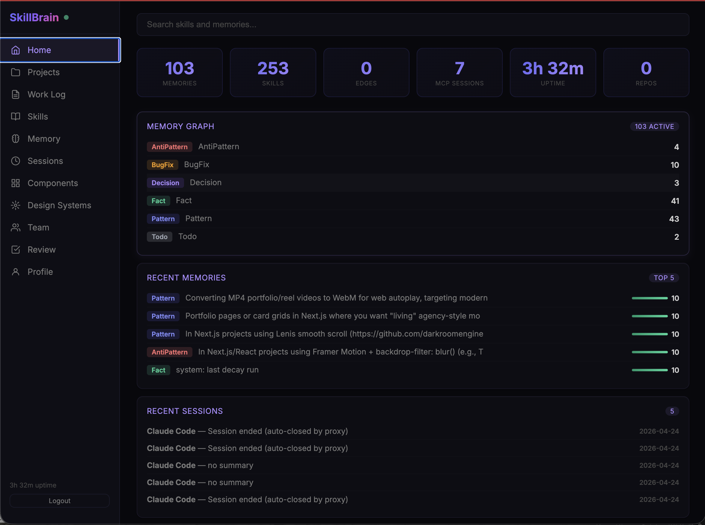</a>
      <p align="center"><b>🏠 Home</b><br/><sub>stats · memory graph · recent memories & sessions</sub></p>
    </td>
    <td width="33%" valign="top">
      <a href="docs/images/dashboard-memory.png">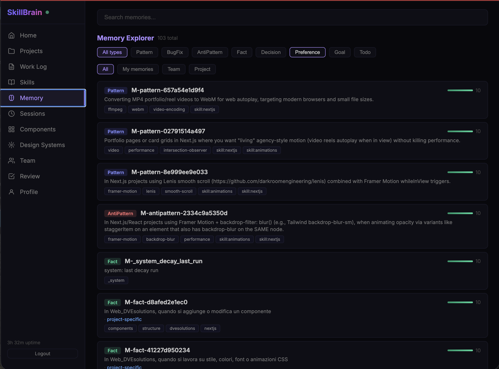</a>
      <p align="center"><b>🧠 Memory Explorer</b><br/><sub>filter by scope · type · author · project</sub></p>
    </td>
    <td width="33%" valign="top">
      <a href="docs/images/dashboard-skills.png">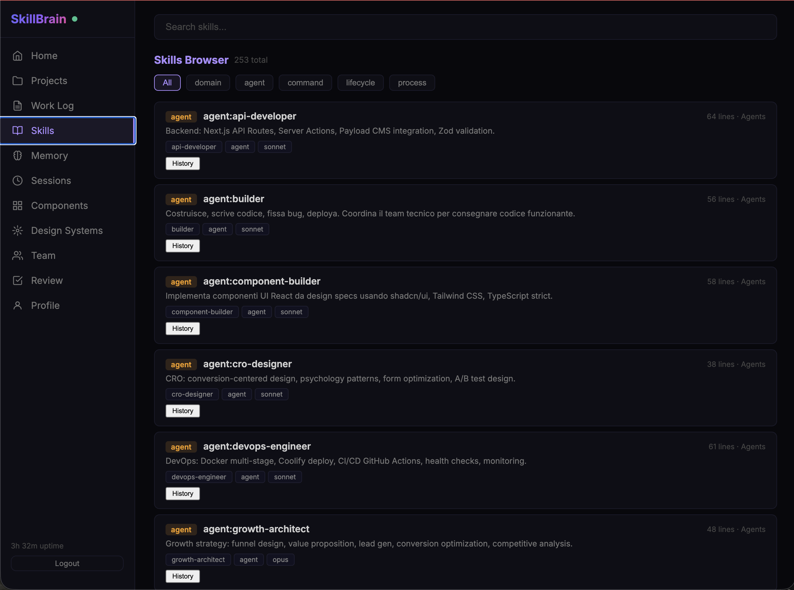</a>
      <p align="center"><b>📚 Skills Browser</b><br/><sub>258 skills · domain · agent · command · lifecycle · process</sub></p>
    </td>
  </tr>
  <tr>
    <td width="33%" valign="top">
      <a href="docs/images/dashboard-components.png">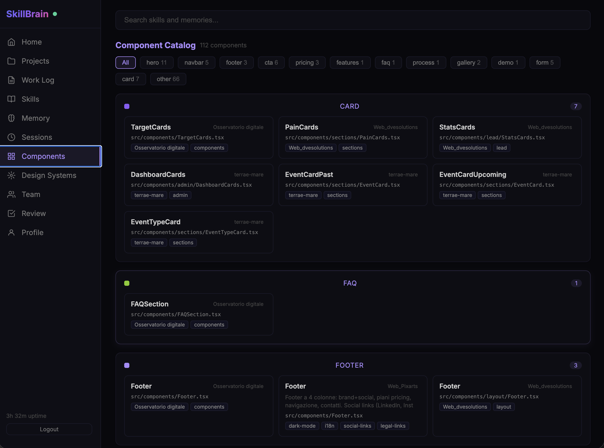</a>
      <p align="center"><b>🧩 Component Catalog</b><br/><sub>hero · cta · pricing · footer · form · gallery …</sub></p>
    </td>
    <td width="33%" valign="top">
      <a href="docs/images/dashboard-design-systems.png">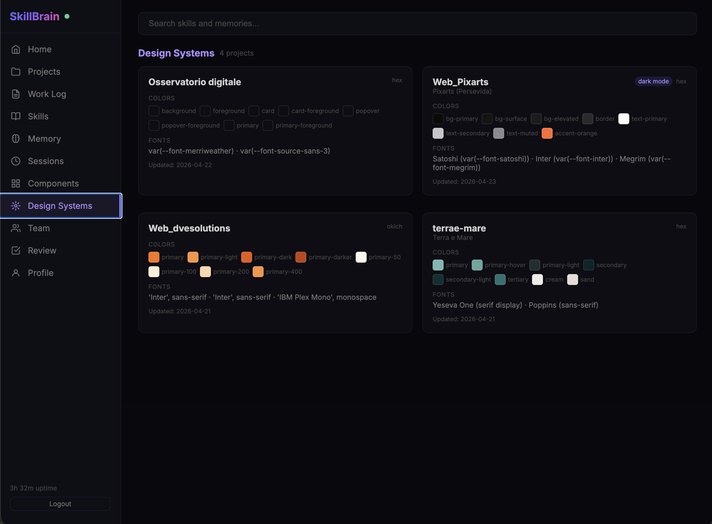</a>
      <p align="center"><b>🎨 Design Systems</b><br/><sub>colors · fonts · tokens scanned per project</sub></p>
    </td>
    <td width="33%" valign="top">
      <a href="docs/images/dashboard-worklog.png">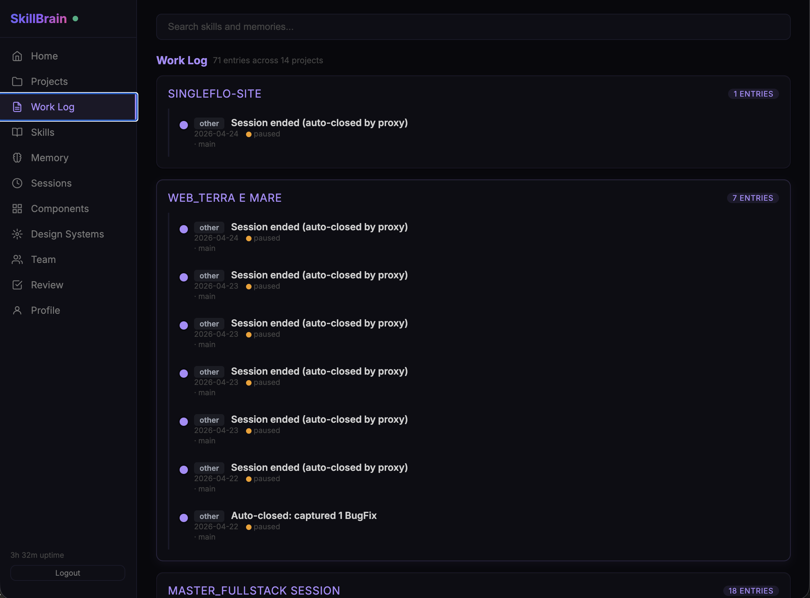</a>
      <p align="center"><b>📝 Work Log</b><br/><sub>deliverables timeline across 14 projects</sub></p>
    </td>
  </tr>
  <tr>
    <td width="33%" valign="top">
      <a href="docs/images/dashboard-whiteboards.png">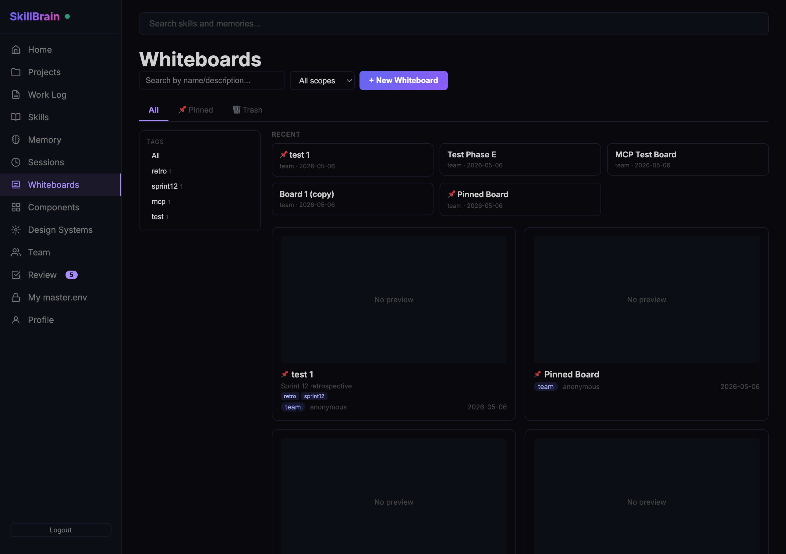</a>
      <p align="center"><b>🗂 Whiteboards list</b><br/><sub>search · tags sidebar · recent · pinned · trash</sub></p>
    </td>
    <td width="33%" valign="top">
      <a href="docs/images/dashboard-whiteboard-canvas.png">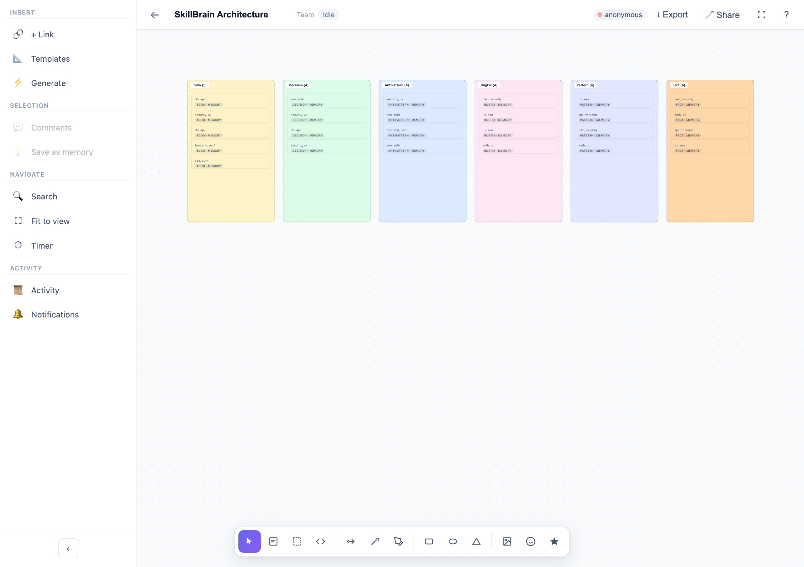</a>
      <p align="center"><b>🎨 Whiteboard canvas</b><br/><sub>frames · sticky · code · shapes · connectors · sb-cards</sub></p>
    </td>
    <td width="33%" valign="top">
      <a href="docs/images/dashboard-whiteboard-generate.png">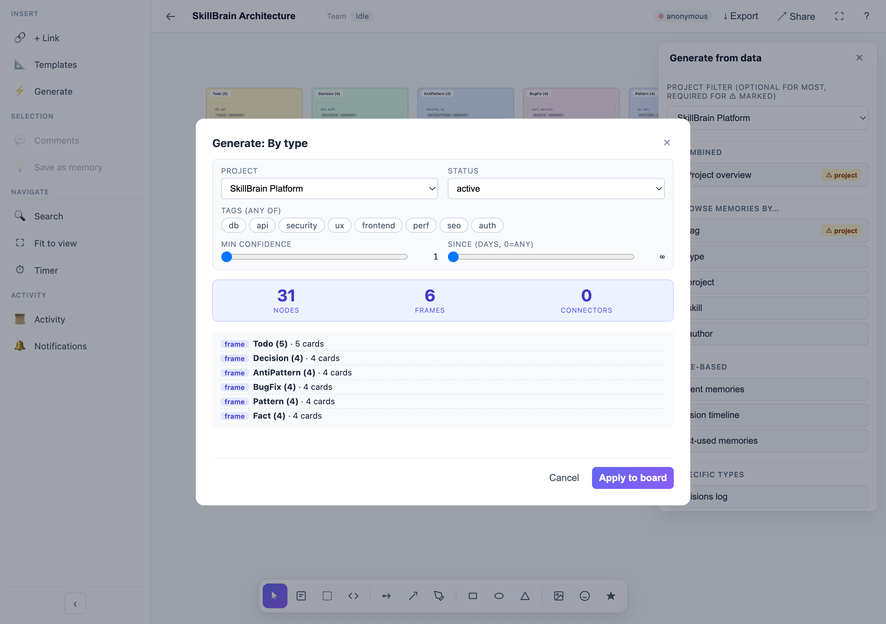</a>
      <p align="center"><b>⚡ Generators</b><br/><sub>14 deterministic recipes · filters · live preview</sub></p>
    </td>
  </tr>
</table>

---

## 55 MCP Tools

### Memory (8)
| Tool | Purpose |
|------|---------|
| `memory_add` | Save a memory (auto-detects contradictions, supports `scope` and `draft`) |
| `memory_search` | Hybrid search (BM25 + vector cosine) across all memory fields |
| `memory_query` | Filter by type, project, scope, author, skill, confidence |
| `memory_load` | Load top-scored memories for current session |
| `memory_add_edge` | Create relationships between memories |
| `memory_stats` | Statistics, contradictions and active drafts |
| `memory_decay` | Apply decay cycle (reinforce / decay / deprecate) |
| `memory_suggest` | AI-suggested memories to promote or merge |

### Skills (11)
| Tool | Purpose |
|------|---------|
| `skill_list` | List all skills with filters |
| `skill_read` | Read full skill content |
| `skill_route` | Find best skills for a task |
| `skill_stats` | Skills statistics by type / category |
| `skill_add` | Create a new skill (draft mode supported) |
| `skill_update` | Update a skill (versioned automatically) |
| `agent_list` | List all registered agents |
| `agent_read` | Read agent prompt |
| `command_list` | List all slash commands |
| `command_read` | Read command content |
| `cortex_briefing` | 5-layer working memory briefing |

### Sessions (6)
| Tool | Purpose |
|------|---------|
| `session_start` | Log session with project + task |
| `session_heartbeat` | Keep long-running sessions alive |
| `session_end` | Close with deliverables + next steps |
| `session_resume` | Full context to continue a project |
| `session_history` | Recent sessions, filter by project or author |
| `session_search` | Full-text search across verbatim past session content |

### Projects (10)
| Tool | Purpose |
|------|---------|
| `project_list` | All projects with status and context |
| `project_list_full` | Full project export including env, stack, CI/CD |
| `project_get` | Read a single project by slug |
| `project_scan` | Detect stack, CMS, deploy target from repo |
| `project_update` | Update project metadata |
| `project_merge` | Merge a duplicate project into another |
| `project_set_env` | Encrypt & store a single env var |
| `project_set_env_batch` | Encrypt & store multiple env vars |
| `project_get_env` | Read decrypted env vars for an authorised user |
| `project_generate_env_example` | Emit a redacted `.env.example` |

### Code Intelligence (7)
| Tool | Purpose |
|------|---------|
| `codegraph_query` | Semantic search by concept |
| `codegraph_context` | 360-degree view of a symbol |
| `codegraph_impact` | Blast radius before editing |
| `codegraph_detect_changes` | Map git diff to affected symbols |
| `codegraph_rename` | Graph-aware multi-file rename |
| `codegraph_list_repos` | All indexed repositories |
| `codegraph_cypher` | Raw SQL against the graph |

### Components & Design Systems (8)
| Tool | Purpose |
|------|---------|
| `component_add` | Register a component with code snippet + tokens |
| `component_list` | List all components with filters |
| `component_get` | Get a single component |
| `component_search` | Full-text search across components |
| `component_scan` | Bulk import from file contents |
| `design_system_scan` | Parse Tailwind config / CSS vars / `tokens.json` |
| `design_system_get` | Read the design system for a project |
| `design_system_set` | Overwrite the design system manually |

### Whiteboards (5) **(NEW)**
| Tool | Purpose |
|------|---------|
| `whiteboard_list` | List boards with filters (scope, project, tag, pinned, search) |
| `whiteboard_read` | Read a board (metadata + nodes + connectors) |
| `whiteboard_create` | Create a new board (with optional seed nodes/tags/description) |
| `whiteboard_add_nodes` | Append nodes/connectors to an existing board |
| `whiteboard_search` | Full-text search across all boards |

---

## Architecture

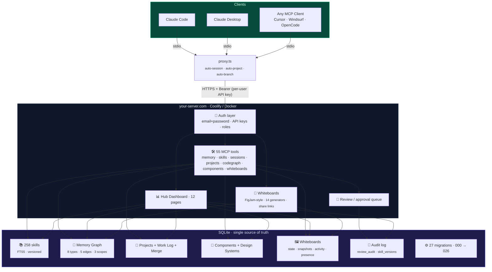

---

## Self-Hosted Setup

### Option A: Connect to an existing server (2 minutes)

Get an API key from your admin (or generate one from your **Profile** page), then add the MCP config as shown in [2-Minute Setup](#2-minute-setup).

### Option B: Deploy your own server

**1. Clone and build**

```bash
git clone https://github.com/deve1993/skillbrain
cd skillbrain/packages/codegraph
npm install && npm run build
```

**2. Import skills**

```bash
node dist/cli.js import-skills ../..
```

**3. Run locally**

```bash
# Local MCP (stdio — single machine, no auth)
node dist/cli.js mcp

# HTTP server (for remote access + dashboard + multi-user)
node dist/cli.js mcp --http --port 3737
```

**4. Bootstrap the admin user**

On first HTTP start, set `ADMIN_EMAIL` and `DASHBOARD_PASSWORD` to bootstrap the admin account. After first login these become optional — the admin manages users from the dashboard.

> `DASHBOARD_PASSWORD` is kept for backwards compatibility (migration `012_deprecate_dashboard_password.sql`), but the preferred auth path is per-user email + password + API keys.

**5. Deploy on Coolify / Docker**

```bash
docker build -t skillbrain .
docker run -p 3737:3737 \
  -v skillbrain-data:/data \
  -e ADMIN_EMAIL=you@team.com \
  -e DASHBOARD_PASSWORD=bootstrap-only-password \
  skillbrain
```

On Coolify: point to `packages/codegraph/Dockerfile`, set env vars, add persistent volume at `/data`.

**6. Configure clients**

Each team member gets their own API key from the dashboard and configures:

```json
"codegraph": {
  "command": "node",
  "args": ["/path/to/dist/cli.js", "mcp-proxy"],
  "env": {
    "SKILLBRAIN_MCP_URL": "https://your-server.com/mcp",
    "CODEGRAPH_AUTH_TOKEN": "user-specific-api-key"
  }
}
```

---

## How It Compares

| Feature | CLAUDE.md | Mem0 / Zep | Spacebot | **Synapse** |
|---------|-----------|------------|----------|----------------|
| Memory | Manual text | Vector DB | Typed graph (Rust) | **Typed graph (SQLite + MCP)** |
| Retrieval | None | Cosine similarity | Keyword | **BM25 + vector embeddings + trigram FTS5 + closet boost** |
| Cross-session | No | API calls | Chat channels | **Shared SQLite via proxy** |
| Memory types | None | Key-value | 8 types | **8 types + 5 edge types + 3 scopes** |
| Contradiction detection | No | No | No | **Auto on save** |
| Confidence decay | No | No | No | **Automatic** |
| Skills | No | No | Generic | **258 domain skills** |
| Project tracking | No | No | No | **Auto-derived + work log + merge** |
| Code intelligence | No | No | No | **AST + impact + call graph** |
| Dashboard | No | Cloud UI | No | **11-page self-hosted hub** |
| Multi-user | No | No | Per-workspace | **Email+password + per-user API keys** |
| Approval workflow | No | No | No | **Draft → review queue + audit** |
| Skill versioning | No | No | No | **Full history + rollback** |
| Setup | 0 min | API key | Cargo build | **2 min (MCP config)** |
| Works with | Claude Code | Any LLM | Discord/Slack | **Any MCP client** |

---

## Skill Catalog (258 total)

| Category | Count | Examples |
|----------|-------|----------|
| Process | 109 | brainstorming, debugging, TDD, planning, review |
| Other (domain) | 34 | specialists, tooling, integrations |
| Commands | 23 | `/frontend`, `/audit`, `/new-project`, `/clone` |
| Agents | 20 | planner, builder, ux-designer, seo-specialist |
| Marketing | 15 | CRO, copywriting, pricing, launch strategy |
| SEO | 14 | audit, technical, content, schema, geo, hreflang |
| Frontend | 9 | nextjs, tailwind, shadcn, i18n, animations |
| Backend | 7 | trpc, auth, forms, database, payments |
| Lifecycle | 5 | codegraph-context, capture-learning, post-session-review |
| CMS | 3 | payload, cms, mongodb |
| Files | 3 | file-handling, pdf, csv |
| Infrastructure | 3 | ci-cd, coolify, docker |
| Legal | 3 | gdpr, iubenda, legal-templates |
| Monitoring | 2 | monitoring-nextjs, monitoring-expert |
| Performance | 2 | performance, web-vitals |
| Realtime | 2 | realtime, websocket-engineer |
| Automation · Security · System · Video | 1 each | n8n, security-headers, system-sync, video-producer |

---

## FAQ

**Q: Does this work with Cursor / Windsurf / OpenCode?**
A: Yes — any tool that supports MCP over stdio, through the included HTTP proxy.

**Q: Can I have multiple users with different permissions?**
A: Yes. Email + password login, admin / user roles, per-user API keys, and every write records the author.

**Q: Can I review memories and skills before they go live?**
A: Yes. Save them as `draft` — they land in the **Review** page queue. Approvals, rejections and rollbacks are logged in `review_audit`.

**Q: What happens to memories created by someone who leaves the team?**
A: Ownership is tracked (`created_by_user_id`). Admins can list and re-assign.

**Q: How do I migrate from v1 (shared `DASHBOARD_PASSWORD`) to v2 (multi-user)?**
A: Set `ADMIN_EMAIL` before first login — the current `DASHBOARD_PASSWORD` bootstraps the admin account. Generate API keys per team member from the **Team** page. The old shared password keeps working as a fallback until you remove it.

**Q: What happens offline?**
A: The proxy needs internet to reach the server. For offline use, run `node cli.js mcp` directly — local SQLite, no server, no multi-user.

**Q: How does it get smarter over time?**
A: Every session captures memories (bugs, patterns, decisions). Confidence grows with validation, decays without use. Draft memories sit in the review queue until approved. Skills auto-evolve when Haiku proposes updates that an admin approves.

**Q: What inspired this?**
A: [Spacebot.sh](https://spacebot.sh) by Spacedrive — their typed memory system with graph edges. We adapted it for MCP + SQLite + self-hosted deployment, and extended it with multi-user auth, approval workflow and skill versioning.

---

## Contributing

Contributions welcome:
- New domain skills (submit as `draft` — admin will review)
- Memory Graph integrations
- Dashboard improvements
- Multi-language support
- Migration scripts between Synapse instances

---

## License

Synapse is dual-licensed:

- **AGPL-3.0** — Free for open source use. If you run a modified version over a network (including SaaS), you must share your source code under AGPL-3.0.
- **Commercial License** — For proprietary/closed-source deployments. Removes all AGPL obligations.

The complete AGPL-3.0 text is in the [LICENSE](LICENSE) file.

**Need a commercial license?** Contact [daniel@pixarts.eu](mailto:daniel@pixarts.eu).

---

*Built with [Claude Code](https://docs.anthropic.com/en/docs/claude-code) + Synapse collective memory*
