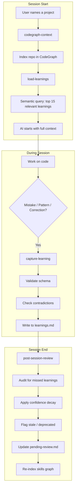
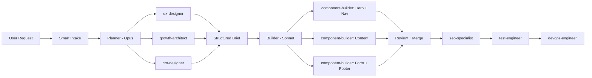

# SkillBrain

> **Your AI coding assistant forgets everything when you close the session.**  
> This fixes that — permanently.


**Built by [Daniel De Vecchi](https://www.linkedin.com/in/danieldevecchi/) · [GitHub](https://github.com/deve1993)**

---

## What Is SkillBrain?

SkillBrain is a **self-improving AI coding workspace** with 6 integrated systems:

1. **300+ Skills** — domain knowledge (Next.js, Stripe, Sentry, tRPC, PWA, etc.) loaded on demand
2. **Self-Improving Memory** — learnings captured, validated, and decayed automatically across sessions
3. **19 Specialized Agents** — parallel multi-agent architecture for complex tasks
4. **CodeGraph** — built-in code intelligence engine (AST parsing, impact analysis, semantic search) -- zero external dependencies
5. **Quality Gates** — 6 automation scripts for security, env validation, deploy checks
6. **Telegram Bot** — remote control your workspace from your phone

The result: each session is smarter than the last. Mistakes made once are never repeated.

---

## Table of Contents

- [The Problem](#the-problem)
- [How It Works](#how-it-works)
- [Architecture](#architecture)
- [Quick Start](#quick-start)
- [1. Skill System (300+)](#1-skill-system-300)
- [2. Self-Improving Memory](#2-self-improving-memory)
- [3. Multi-Agent Architecture](#3-multi-agent-architecture)
- [4. CodeGraph — Built-in Code Intelligence](#4-codegraph--built-in-code-intelligence)
- [5. Quality Gates & Automation](#5-quality-gates--automation)
- [6. Telegram Bot](#6-telegram-bot)
- [Why This Architecture](#why-this-architecture)
- [FAQ](#faq)
- [Contributing](#contributing)

---

## The Problem

You've been using Claude Code (or Cursor, Windsurf, OpenCode) for months. You've fixed the same bug three times. You've re-explained your preferred code style dozens of times. Every new session, the AI starts from zero — no memory of what you've built, how you work, or what went wrong last time.

This is not a Claude problem. It's an architecture problem. And it's solvable.

---

## How It Works



---

## Architecture

```
.claude/                          → symlink to .opencode/
  skill/                          → 120 domain skills
    nextjs/                       →   Next.js 15 App Router patterns
    trpc/                         →   tRPC v11 type-safe APIs
    realtime/                     →   SSE, Socket.io, Pusher, Supabase RT
    background-jobs/              →   BullMQ, Inngest, Trigger.dev, QStash
    monitoring-nextjs/            →   Sentry, Pino, OpenTelemetry
    security-headers/             →   CSP, CORS, rate limiting, OWASP
    ci-cd/                        →   GitHub Actions, Docker, Changesets
    performance/                  →   Bundle analysis, CWV, Lighthouse CI
    pwa/                          →   Service workers, push notifications
    file-handling/                →   S3/R2, PDF gen, CSV/Excel
    quality-gates/                →   Automation scripts reference
    ... (110 more)
  command/                        → 23 slash commands
  agent/                          → 3 agent configs (orchestrator, planner, builder)
  skill/INDEX.md                  → Full routing table

.agents/skills/                   → 112 external/lifecycle skills
  codegraph-context/               →   Code intelligence (session start)
  capture-learning/               →   Persist learnings (during session)
  post-session-review/            →   Audit + decay (session end)
  ai-sdk/                         →   Vercel AI SDK
  redis-development/              →   Redis patterns
  graphql-architect/              →   GraphQL schema design
  typescript-pro/                 →   Advanced TypeScript
  devops-engineer/                →   CI/CD, Docker, K8s, Terraform
  react-native-best-practices/   →   React Native
  expo-*/                         →   12 Expo skills
  ... (100 more)

~/.config/skillbrain/             → Automation layer (outside repo)
  .env                            →   Master API keys (never committed)
  telegram-bot.sh                 →   Telegram bot (always-on)
  notify.sh                       →   Session end notifications
  hooks/
    secrets-scan.sh               →   Pre-commit secret detection
    env-check.sh                  →   Env var validation
    new-project.sh                →   Project bootstrap
    pre-deploy.sh                 →   Deploy checklist
    dep-audit.sh                  →   Dependency audit
    commit-msg-check.sh           →   Conventional commits

AGENTS.md                         → Smart Intake Protocol + Rules
CLAUDE.md                         → Skill routing table
Progetti/                         → Client project directories
```

---

## Quick Start

### Prerequisites

- [Claude Code](https://docs.anthropic.com/en/docs/claude-code) or compatible agent (OpenCode, Cursor with MCP)
- CodeGraph (built-in, no external install needed)

```bash
# CodeGraph is included in the project — build it once:
cd packages/codegraph && npm run build
```

### Installation

**1. Clone the repo**

```bash
git clone https://github.com/deve1993/skillbrain
cd skillbrain
```

**2. Install external skills**

```bash
npx skills add wshobson/agents -y
npx skills add vercel/ai -y
npx skills add redis/agent-skills -y
npx skills add expo/skills -y
npx skills add callstackincubator/agent-skills -y
npx skills add jeffallan/claude-skills -y
```

**3. Set up automation**

```bash
# Copy hooks to your config
mkdir -p ~/.config/skillbrain/hooks
cp scripts/hooks/* ~/.config/skillbrain/hooks/
chmod +x ~/.config/skillbrain/hooks/*.sh

# Create master env file
cp scripts/.env.template ~/.config/skillbrain/.env
# Edit with your actual API keys
```

**4. Index and start**

```bash
node packages/codegraph/dist/cli.js analyze . --skip-git
```

Start a session and say: `"Work on [your project]"`

---

## 1. Skill System (300+)

Skills are domain knowledge files loaded on demand when a task matches.

### Skill Categories

| Category | Count | Examples |
|----------|-------|---------|
| **Core Frontend** | 8 | nextjs, tailwind, shadcn, i18n, seo, fonts, animations, state |
| **Backend & API** | 6 | trpc, auth, forms, database, graphql-architect, api-designer |
| **Real-time** | 2 | realtime (SSE/Socket.io/Pusher), websocket-engineer |
| **Infrastructure** | 8 | ci-cd, coolify, docker, devops-engineer, terraform-engineer, kubernetes-specialist, sre-engineer, monitoring-expert |
| **Monitoring** | 2 | monitoring-nextjs (Sentry/Pino/OTel), analytics |
| **Security** | 3 | security-headers, secure-code-guardian, security-reviewer |
| **Performance** | 2 | performance (CWV/Lighthouse CI), database-optimizer |
| **Data & Files** | 4 | file-handling (S3/PDF/CSV), redis-development, postgres-pro, sql-pro |
| **AI Integration** | 2 | ai-sdk (Vercel AI SDK), rag-architect |
| **Mobile** | 15 | react-native-best-practices, 12 expo skills, building-native-ui |
| **CMS** | 3 | payload, cms (Sanity/Strapi/Contentful), mongodb |
| **SEO** | 15+ | Full suite: audit, technical, content, schema, geo, hreflang, programmatic |
| **Marketing** | 20+ | CRO, copywriting, ads, email sequences, pricing, launch strategy |
| **Payments** | 1 | payments (Stripe, LemonSqueezy) |
| **Async Jobs** | 1 | background-jobs (BullMQ, Inngest, Trigger.dev, QStash) |
| **PWA** | 1 | pwa (service workers, push notifications, offline) |
| **Legal** | 3 | gdpr, iubenda, legal-templates |
| **Video** | 2 | remotion, ffmpeg |
| **Process** | 14 | brainstorming, systematic-debugging, TDD, writing-plans, dispatching-parallel-agents, etc. |
| **Quality** | 5 | verification-before-completion, code-review, git-worktrees, quality-gates |

### How Routing Works

```
User: "Add Stripe payments to this project"

1. Smart Intake classifies → COMPONENTE
2. Loads skill: payments/SKILL.md (487 lines of Stripe patterns)
3. Loads skill: forms/SKILL.md (for checkout form)
4. Checks learnings: any past Stripe issues?
5. Implements with full context
```

The routing table is in `.claude/skill/INDEX.md` — 360+ lines mapping every task to its skill(s).

### External Skills (from [skills.sh](https://skills.sh))

| Source | Count | Highlights |
|--------|-------|-----------|
| [wshobson/agents](https://skills.sh/wshobson/agents) | 149 | api-designer, graphql-architect, postgres-pro, typescript-pro, monitoring-expert, microservices-architect |
| [expo/skills](https://skills.sh/expo/skills) | 12 | building-native-ui, expo-cicd-workflows, expo-api-routes, expo-deployment |
| [callstackincubator](https://skills.sh/callstackincubator/agent-skills) | 4 | react-native-best-practices, github-actions |
| [jeffallan/claude-skills](https://skills.sh/jeffallan/claude-skills) | ~20 | devops-engineer, terraform-engineer, kubernetes-specialist, websocket-engineer |
| [redis/agent-skills](https://skills.sh/redis/agent-skills) | 1 | redis-development (data structures, caching, vector search) |
| [vercel/ai](https://skills.sh/vercel/ai) | 1 | ai-sdk (generateText, streamText, tool calling, useChat) |

---

## 2. Self-Improving Memory

### The Learning Lifecycle

Every learning starts at `confidence: 1` (tentative) and evolves based on real usage:

```
Captured → confidence: 1   (treat as suggestion)
Validated 3x → confidence: 4   (reliable pattern)
Validated 8x → confidence: 8+  (established rule)
Not used in 15 sessions → pending-review
Not used in 30 sessions → deprecated
```

### Learning Schema

```yaml
## Learning L-next-002
id: "L-next-002"
date: "2025-01-15"
type: "bug-fix"
scope: "global"
tags: [next-intl, i18n, server-components]
confidence: 1
context: "In Next.js 15 App Router with next-intl..."
problem: "Using useTranslations() in a Server Component throws a runtime error"
solution: "Server Components: 'const t = await getTranslations()' — Client: 'const t = useTranslations()'"
reason: "getTranslations() is async Server-safe. useTranslations() is the React hook. Not interchangeable."
validated_by: ["2025-01-15"]
```

Every learning requires: `context`, `problem`, `solution`, `reason`, `tags`. Missing any field → rejected.

### Anti-Poisoning: Contradiction Detection

Before writing a new learning, the system searches for existing learnings sharing 2+ tags:

```
⚠️ CONFLICT DETECTED
New:      "Always use fetch directly" [tags: fetch, api]
Existing: L-next-012 "Use the custom useFetch hook" — confidence: 4

A) New supersedes old
B) Both valid with different scope
C) Cancel
```

You decide. The system never auto-resolves contradictions.

### Confidence Decay

| Sessions without use | Effect |
|---------------------|--------|
| 5+ sessions | `confidence -= 1` |
| 15+ sessions | `status: pending-review` |
| 30+ sessions | `status: deprecated` (not loaded) |

Bad learnings decay and disappear. Good ones survive and strengthen.

### Human Review Queue

```markdown
# pending-review.md

## 2025-01-20
### Promotion Candidates
- L-next-012: project-specific → global? Validated in 3 projects — approve/reject?

### Decay Alerts
- L-debug-003: 16 sessions without validation — keep or deprecate?
```

---

## 3. Multi-Agent Architecture

SkillBrain uses a **2-tier agent system** with parallel dispatch for complex tasks.

### Agent Hierarchy (19 agents)

```
@planner (Opus — deep reasoning)           @builder (Sonnet — fast execution)
    │                                           │
    ├── ux-designer                             ├── component-builder
    ├── ui-designer                             ├── api-developer
    ├── motion-designer                         ├── i18n-engineer
    ├── growth-architect (Opus)                 ├── test-engineer
    ├── cro-designer                            ├── devops-engineer
    ├── seo-specialist                          ├── payload-cms
    └── saas-copywriter                         ├── n8n-workflow
                                                ├── performance-engineer
                                                └── security-auditor (read-only)
```

### How Parallel Dispatch Works



**Real example:**

```
User: "Build the landing page for Restaurant Da Mario"

1. Smart Intake → classifies as NEW_SITE → collects brief
2. @planner dispatches IN PARALLEL:
   ├── Agent(ux-designer): wireframes + user flow
   ├── Agent(growth-architect): funnel strategy
   └── Agent(cro-designer): conversion patterns
   → synthesizes into structured brief

3. @builder dispatches IN PARALLEL (git worktree isolation):
   ├── Agent(component-builder): Hero + Nav
   ├── Agent(component-builder): Content sections
   └── Agent(component-builder): Contact form + Footer
   → review + merge

4. Sequential: SEO → Tests → Deploy
```

### Task Routing

| Task Type | Lead | Parallel Subagents |
|-----------|------|--------------------|
| New site / landing | @planner → @builder | ux + ui + growth → component-builder × 3 |
| Marketing strategy | @planner | growth + cro + copywriter + seo |
| UI component | @builder | component-builder (+ ui-designer if needed) |
| Bug fix | @builder | direct (or systematic-debugging skill) |
| Full audit | @builder | security + performance + seo in parallel |
| CMS setup | @builder | payload-cms + api-developer |
| Deploy | @builder | devops-engineer |
| Refactor | @builder | CodeGraph impact analysis → component-builder |

### Isolation with Git Worktrees

Each parallel agent works in an **isolated git worktree** — no merge conflicts, no stepping on each other's changes. After completion, work is reviewed and merged back.

### Smart Intake Protocol

Every request is auto-classified before execution:

| Signal | Type | Action |
|--------|------|--------|
| "landing page", "sito", "website" | NEW_SITE | Brief required → design first |
| "componente", "feature", "button" | COMPONENT | Start directly |
| "fix", "bug", "errore" | FIX | Start directly (systematic-debugging if complex) |
| "audit", "performance", "SEO" | AUDIT | Parallel agents |
| "form" (any form) | FORM | **Stop and ask:** where to send data? (Odoo CRM / Payload / Email / Custom) |
| "refactor" | REFACTOR | CodeGraph impact analysis first |

### Effort Levels

| Effort | Agent | Use Case |
|--------|-------|----------|
| `max` | @planner, growth-architect | Deep reasoning, strategy |
| `high` | @builder, component-builder | Precise execution |
| `medium` | test-engineer, i18n, devops | Repetitive tasks |
| `low` | Mechanical tasks | Template-based |

---

## 4. CodeGraph — Built-in Code Intelligence

CodeGraph is our own code intelligence engine, built from scratch with zero heavy dependencies. Faster indexing, SQLite storage, and full MCP integration.

### How It Works

```
codegraph analyze /path/to/repo
  → walks files (respects .gitignore)
  → parses AST with ts-morph (JS/TS/JSX/TSX)
  → extracts symbols (functions, classes, methods, interfaces)
  → builds call graph (including JSX component usage)
  → resolves cross-file calls via import analysis
  → detects communities (Louvain algorithm)
  → detects execution flows (BFS from entry points)
  → stores everything in SQLite with FTS5 search
  → registers in global registry
```

### Performance

| Metric | GitNexus | CodeGraph |
|--------|----------|-----------|
| Index time (115 files) | ~8s | **1.0s** |
| Storage size | 38MB (binary) | **~2MB** (SQLite) |
| Runtime dependencies | 20+ | **5** |
| Native binaries | closed-source | open (better-sqlite3) |

### CLI Commands

```bash
codegraph analyze [path]    # Index a repo (incremental by default)
codegraph analyze --force   # Full re-index
codegraph status [path]     # Check index freshness vs git HEAD
codegraph list              # Show all indexed repos
codegraph clean [path]      # Remove index
codegraph mcp               # Start MCP server on stdio
```

### MCP Tools (7)

Available to Claude Code / AI agents via MCP protocol:

| Tool | Purpose |
|------|---------|
| `codegraph_list_repos` | List all indexed repositories |
| `codegraph_query` | Semantic search by concept, symptom, or keyword (FTS5 + BM25) |
| `codegraph_context` | 360-degree view: callers, callees, processes, community |
| `codegraph_impact` | Blast radius at depth 1/2/3 with confidence scores and risk level |
| `codegraph_detect_changes` | Map git diff to affected symbols and processes |
| `codegraph_rename` | Graph-aware multi-file rename with dry-run preview |
| `codegraph_cypher` | Raw SQL queries against the graph database |

### MCP Resources (7)

| Resource | Content |
|----------|---------|
| `codegraph://repos` | All indexed repositories |
| `codegraph://repo/{name}/context` | Codebase overview + staleness check |
| `codegraph://repo/{name}/clusters` | Functional areas (communities) |
| `codegraph://repo/{name}/processes` | Execution flows |
| `codegraph://repo/{name}/schema` | Graph schema + SQL query examples |
| `codegraph://repo/{name}/cluster/{name}` | Members of a community |
| `codegraph://repo/{name}/process/{name}` | Step-by-step trace of an execution flow |

### Auto-Indexing

A post-commit hook automatically re-indexes the repo after every git commit (runs in background, non-blocking).

---

## 5. Quality Gates & Automation

### Automation Scripts (`~/.config/skillbrain/hooks/`)

| Script | Purpose | When to use |
|--------|---------|-------------|
| `secrets-scan.sh` | Detects 15+ secret patterns (Stripe, AWS, Telegram, GitHub, JWT, DB strings, private keys) | Before every commit |
| `env-check.sh <path>` | Validates env vars against `.env.template` + auto-detects required vars from `package.json` | Start of session / before build |
| `new-project.sh <path>` | Bootstraps `.env.local` with generated secrets + copies shared keys from master env | New project |
| `pre-deploy.sh <path>` | 8 checks: git, deps, build, lint, types, tests, env, security, bundle size | Before deploy |
| `dep-audit.sh <path>` | Vulnerabilities, outdated packages, heavy bundles with lighter alternatives | Weekly / on-demand |
| `commit-msg-check.sh` | Conventional commit format enforcement | Every commit |

### Master Environment File

All shared API keys live in `~/.config/skillbrain/.env` (never committed):

```
Telegram, n8n, Database, Supabase, Auth, Payload, Stripe, Resend,
Sentry, Analytics (PostHog/Plausible/GA4), AI/LLM (OpenAI/Anthropic),
Upstash, S3/R2/Vercel Blob, Cloudinary, Pusher, Odoo, Coolify
```

New projects auto-copy shared keys via `new-project.sh`.

### Enforced Rules

**Security:**
- No hardcoded secrets — always `process.env.VAR_NAME`
- No `any`, `@ts-ignore`, `as unknown as X`
- Input sanitization with Zod at every API boundary
- CSP headers in production

**Code Quality:**
- Conventional commits: `type(scope): description`
- Branch naming: `feat/`, `fix/`, `chore/`, `refactor/`
- No `console.log` in production — use Pino logger
- Error handling: try/catch + log + proper HTTP status, never swallow errors
- Type-safe env with Zod validation

**Performance:**
- Bundle budget: < 300KB first-load JS per route
- No barrel imports from heavy libraries
- Dependency weight check before `pnpm add` (moment→dayjs, lodash→native, axios→fetch)

**Accessibility:**
- Semantic HTML, ARIA labels on interactive elements
- Focus management, visible focus ring
- WCAG AA contrast (4.5:1 text, 3:1 large)

**Deploy:**
- `pre-deploy.sh` mandatory before production
- Health checks: `/api/health` (liveness) + `/api/ready` (readiness)
- Source maps to Sentry only, never public

---

## 6. Telegram Bot

An always-on Telegram bot provides remote control of your workspace from your phone.

### Commands

| Command | Action |
|---------|--------|
| `/status` | Workspace stats — skills, learnings, projects, disk space, last commit |
| `/projects` | List all projects with env and git status |
| `/env <name>` | Validate env vars for a specific project |
| `/audit <name>` | Run dependency audit (vulnerabilities, outdated, heavy packages) |
| `/deploy <name>` | Run full pre-deploy checklist (build, lint, tests, security) |
| `/secrets <name>` | Scan project for exposed secrets |
| `/learnings` | Show recently captured learnings |
| `/skills` | Skill count by category (domain, agents, commands) |
| `/ip` | Public and local IP address |
| `/uptime` | System uptime, load, RAM, Docker containers, Node processes |
| `/help` | Full command list |

### Setup

```bash
# 1. Create bot via @BotFather on Telegram → get token
# 2. Add to ~/.config/skillbrain/.env:
TELEGRAM_BOT_TOKEN=your_token
TELEGRAM_CHAT_ID=your_chat_id

# 3. Start the bot
bash ~/.config/skillbrain/telegram-bot.sh
```

### Auto-Start (macOS LaunchAgent)

The bot runs as a macOS LaunchAgent — starts on boot, auto-restarts on crash:

```xml
<!-- ~/Library/LaunchAgents/com.skillbrain.telegram-bot.plist -->
RunAtLoad: true
KeepAlive: true
ThrottleInterval: 10 seconds
```

```bash
# Load the service
launchctl load ~/Library/LaunchAgents/com.skillbrain.telegram-bot.plist

# Check status
launchctl list | grep skillbrain
```

### Notifications

The bot also sends **proactive notifications** at the end of every coding session:

```
SkillBrain — Session Review
2026-04-13 10:37

Stats:
• New learnings: 2
• Total learnings: 15
• Total skills: 300
• Pending review: 1
```

If n8n is unreachable, the notification is sent directly via Telegram API (fallback).

---

## Why This Architecture

### The Token Math

| Without SkillBrain | With SkillBrain (after session 5) |
|---------------------|-------------------------------|
| 8k–15k tokens exploring codebase | 0–3k (already know structure) |
| 3k–8k rediscovering patterns | Loaded in 15 learnings (~3k) |
| 5k–12k error/correction cycles | Minimal (errors don't repeat) |
| **16k–35k total** | **4k–12k total** |

**Net saving: ~14k tokens per session** after break-even (session 3–5).

### Why 15 Learnings Max

Loading all learnings would fill the context window. The hard cap of 15 ensures:
- Relevant learnings are always loaded
- Context window stays clean for actual work
- Retrieval quality stays high (sorted by confidence × recency × relevance)

### Why Human-in-the-Loop

Project-specific patterns should only become global after validation across multiple projects and explicit human approval. Automatic promotion risks converting a coincidence into a rule.

### Why Parallel Agents

A landing page has 6+ independent sections. Building them sequentially takes 6× longer. With parallel dispatch and git worktree isolation, 3 agents build 3 sections simultaneously — then merge.

---

## Extending the System

### Adding a New Skill

```bash
mkdir -p .claude/skill/your-skill-name
# Create SKILL.md with frontmatter:
# ---
# name: your-skill-name
# description: When to use this skill
# version: 1.0.0
# ---
```

The system automatically creates `learnings.md` on next `post-session-review`.

### Adding a New Project

```bash
# Bootstrap env + secrets
bash ~/.config/skillbrain/hooks/new-project.sh ./Progetti/new-project "ProjectName"

# Index for code intelligence
node packages/codegraph/dist/cli.js analyze ./Progetti/new-project
```

### Installing More Skills

Browse [skills.sh](https://skills.sh) and install:

```bash
npx skills add author/repo -y
```

---

## FAQ

**Q: Does this work with Cursor / Windsurf / OpenCode?**  
A: Yes, any agent that supports MCP and skill/rules files.

**Q: Will it work on Windows?**  
A: The skill system works anywhere. LaunchAgents are macOS-specific (use systemd on Linux, Task Scheduler on Windows).

**Q: How long until I see value?**  
A: Sessions 1–2 are setup. Sessions 3–5 break even. From session 6+ you consistently save tokens and avoid repeated mistakes.

**Q: Can I use this with multiple projects?**  
A: Yes. CodeGraph supports multiple indexed repos. The `scope` field in learnings prevents cross-project bleed.

**Q: Can I use a different Telegram bot for notifications vs commands?**  
A: Yes, but the default setup uses one bot for both. Configure in `~/.config/skillbrain/.env`.

---

## Contributing

Contributions welcome — especially:

- New domain skills (Vue, SvelteKit, Django, Rails, etc.)
- Seed learnings for popular frameworks
- Automation scripts for other platforms (Linux systemd, Windows)
- Translations of the lifecycle skills
- Bug reports

Open an issue or a PR. If you build something interesting on top of SkillBrain, tag me — I'd love to see it.

---

## Contributors

<table>
  <tr>
    <td align="center">
      <a href="https://github.com/deve1993">
        
        <br /><b>Daniel De Vecchi</b>
      </a>
      <br />Creator & Maintainer
      <br /><a href="https://www.linkedin.com/in/danieldevecchi/">LinkedIn</a>
    </td>
  </tr>
</table>

SkillBrain is the memory system I built for my own daily workflow. After months of losing context between sessions and re-explaining the same patterns, I decided to solve it properly.

→ **Questions or ideas?** Open an issue or reach out on [LinkedIn](https://www.linkedin.com/in/danieldevecchi/).

---

## License

MIT — use freely, attribute if you build on it.

---

*Built with [Claude Code](https://docs.anthropic.com/en/docs/claude-code) + CodeGraph*
