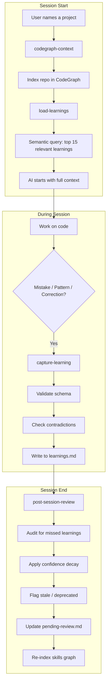

# SkillBrain

> **Your AI coding assistant forgets everything when you close the session.**  
> This fixes that — permanently.


**Built by [Daniel De Vecchi](https://www.linkedin.com/in/danieldevecchi/) · [GitHub](https://github.com/deve1993)**

---

## The Problem

You've been using Claude Code (or Cursor, Windsurf, OpenCode) for months. You've fixed the same bug three times. You've re-explained your preferred code style dozens of times. Every new session, the AI starts from zero — no memory of what you've built, how you work, or what went wrong last time.

This is not a Claude problem. It's an architecture problem. And it's solvable.

---

## The Solution

**Claude Persistent Skills System** is a structured, self-improving knowledge layer that sits between you and your AI assistant. It gives the AI:

- **Persistent memory** — learnings captured from every session, never lost
- **Project intelligence** — code knowledge graphs via CodeGraph indexed before every session
- **Anti-poisoning** — a confidence scoring system that prevents bad learnings from propagating
- **Human-in-the-loop** — you approve promotions from project-specific to global knowledge
- **Semantic retrieval** — loads the 15 most relevant learnings per session, not all of them

The result: each session is smarter than the last. Mistakes made once are never repeated.

---

## How It Works



### The Learning Lifecycle

Every learning starts at `confidence: 1` (tentative) and evolves based on real usage:

```
Captured → confidence: 1   (treat as suggestion)
Validated 3x → confidence: 4   (reliable pattern)
Validated 8x → confidence: 8+  (established rule)
Not used in 15 sessions → pending-review
Not used in 30 sessions → deprecated
```

**Anti-poisoning**: learnings with `confidence ≤ 2` are surfaced as suggestions, not rules. Bad learnings decay and disappear. Good ones survive and strengthen.

---

## Architecture

```
.agents/
└── skills/
    ├── _schema/
    │   └── learning-template.yml      # Canonical learning schema
    ├── _pending/                       # Subagent temp files (race-condition safe)
    │
    ├── SKILLS-MAP.md                   # Visual graph of the entire ecosystem
    ├── pending-review.md               # Human review queue
    │
    ├── capture-learning/               # Writes validated learnings
    │   └── SKILL.md
    ├── post-session-review/            # Mandatory end-of-session audit
    │   └── SKILL.md
    ├── load-learnings/                 # Retrieval with hard cap
    │   └── SKILL.md
    ├── codegraph-context/               # Loads code graph + learnings
    │   ├── SKILL.md
    │   └── learnings.md
    │
    ├── systematic-debugging/
    │   ├── SKILL.md
    │   └── learnings.md               # ← grows with every session
    ├── next-best-practices/
    │   ├── SKILL.md
    │   └── learnings.md
    └── [19 other skills]/
        ├── SKILL.md
        └── learnings.md
```

Each skill owns its learnings. The system is modular — add your own skills and they automatically get a `learnings.md`.

---

## Quick Start

### Prerequisites

- [Claude Code](https://docs.anthropic.com/en/docs/claude-code) or compatible agent (OpenCode, Cursor with MCP)
- CodeGraph (built-in, no external install needed)

```bash
# CodeGraph is included in the project — build it once:
cd packages/codegraph && npm run build
```

### Installation

**1. Clone this repo**

```bash
git clone https://github.com/deve1993/skillbrain
cd skillbrain
```

**2. Index the skills folder**

```bash
node packages/codegraph/dist/cli.js analyze .agents/skills --skip-git
```

**3. Add to your Claude Code config**

In your project's `AGENTS.md` or `.claude/CLAUDE.md`, add the skills path:

```markdown
Skills directory: .agents/skills/
```

**4. Start a session and say:**

```
"Lavora su [your project]"
# or
"Work on [your project]"
```

The `codegraph-context` skill triggers automatically, loads your code graph, and pulls the relevant learnings.

### First Session

At the end of your first real coding session, invoke:

```
post-session-review
```

This captures what was learned and sets the flywheel in motion.

---

## Skill Reference

| Skill | Type | Purpose |
|-------|------|---------|
| `codegraph-context` | Lifecycle | Loads code graph + learnings at session start |
| `load-learnings` | Lifecycle | Retrieves top 15 relevant learnings |
| `capture-learning` | Lifecycle | Writes validated learnings with schema enforcement |
| `post-session-review` | Lifecycle | End-of-session audit, decay, re-index |
| `using-superpowers` | Lifecycle | Orchestrates skill invocation order |
| `brainstorming` | Process | Explores design before implementation |
| `systematic-debugging` | Process | Root cause analysis — no guessing |
| `writing-plans` | Process | Creates implementation plans |
| `executing-plans` | Process | Executes plans task by task |
| `test-driven-development` | Process | TDD enforcement |
| `subagent-driven-development` | Process | Parallel task dispatch with review gates |
| `dispatching-parallel-agents` | Process | Multi-domain parallel work |
| `frontend-design` | Implementation | UI/UX design patterns |
| `next-best-practices` | Implementation | Next.js 15 App Router best practices |
| `vercel-react-best-practices` | Implementation | React performance optimization |
| `ui-ux-pro-max` | Implementation | Advanced UI system |
| `web-design-guidelines` | Implementation | Web design standards |
| `audit-website` | Implementation | Site health check |
| `verification-before-completion` | Quality | Verify before claiming done |
| `requesting-code-review` | Quality | Code review request template |
| `receiving-code-review` | Quality | Code review response protocol |
| `finishing-a-development-branch` | Quality | Branch completion workflow |
| `using-git-worktrees` | Quality | Isolated git worktrees |

---

## The Learning System

### Capturing a Learning

Learnings are captured by the `capture-learning` skill. They follow a strict schema:

```yaml
## Learning L-next-002
id: "L-next-002"
date: "2025-01-15"
type: "bug-fix"
scope: "global"
tags: [next-intl, i18n, server-components]
confidence: 1
context: "In Next.js 15 App Router with next-intl..."
problem: "Using useTranslations() in a Server Component throws a runtime error"
solution: "Server Components: 'const t = await getTranslations()' — Client Components: 'const t = useTranslations()'"
reason: "getTranslations() is async Server-safe. useTranslations() is the React hook for Client Components. Not interchangeable."
validated_by: ["2025-01-15"]
```

Every learning requires all five core fields: `context`, `problem`, `solution`, `reason`, `tags`.  
Missing any field → rejected. Too generic → rejected. File paths → rejected.

### Anti-Poisoning: Contradiction Detection

Before writing a new learning, the system searches for existing learnings sharing 2+ tags:

```
⚠️ CONFLICT DETECTED
New:      "Always use fetch directly" [tags: fetch, api]
Existing: L-next-012 "Use the custom useFetch hook" — confidence: 4

A) New supersedes old
B) Both valid with different scope
C) Cancel
```

You decide. The system never auto-resolves contradictions.

### Confidence Decay

Learnings lose confidence over time if not validated:

| Sessions without use | Effect |
|---------------------|--------|
| 5+ sessions | `confidence -= 1` |
| 15+ sessions | `status: pending-review` |
| 30+ sessions | `status: deprecated` (not loaded) |

Deprecated learnings are not deleted — they stay in the file as history but are never loaded.

### Human Review Queue

High-stakes decisions always go to you:

```markdown
# pending-review.md

## 2025-01-20
### Promotion Candidates
- L-next-012: project-specific → global? Validated in 3 projects — approve/reject?

### Decay Alerts
- L-debug-003: 16 sessions without validation — keep or deprecate?
```

You review periodically. I apply your decisions.

---

## Why This Architecture

### The token math

| Without system | With system (after session 5) |
|---------------|-------------------------------|
| 8k–15k tokens exploring codebase | 0–3k (already know structure) |
| 3k–8k rediscovering patterns | Loaded in 15 learnings (~3k) |
| 5k–12k error/correction cycles | Minimal (errors don't repeat) |
| **16k–35k total** | **4k–12k total** |

**Net saving: ~14k tokens per session** after break-even (session 3–5).

### Why 15 learnings max

Loading all learnings would fill the context window. The hard cap of 15 ensures:
- Relevant learnings are always loaded
- Context window stays clean for actual work
- Retrieval quality stays high (sorted by confidence × recency × relevance)

### Why human-in-the-loop for promotions

Project-specific patterns should only become global after validation across multiple projects and explicit human approval. Automatic promotion risks converting a coincidence into a rule.

---

## Extending the System

### Adding a new skill

1. Create the directory: `.agents/skills/your-skill-name/`
2. Write `SKILL.md` with frontmatter
3. The system automatically creates `learnings.md` on next `post-session-review`

### Adding seed learnings

Use `capture-learning` with `confidence: 3` (human-validated):

```yaml
confidence: 3
created_in: "manual-seed-YYYY-MM-DD"
```

### Adding a new project

```bash
# Git repo
node packages/codegraph/dist/cli.js analyze /path/to/project

# Non-git folder
node packages/codegraph/dist/cli.js analyze /path/to/project --skip-git
```

Then start a session and say "work on [project-name]".

---

## FAQ

**Q: Does this work with Cursor / Windsurf / OpenCode?**  
A: Yes, any agent that supports MCP and skill/rules files. CodeGraph MCP works with all major editors.

**Q: Will it work on Windows?**  
A: The skill system works anywhere. CodeGraph works on macOS, Linux, and Windows (anywhere Node.js runs).

**Q: How long until I see value?**  
A: Sessions 1–2 are setup. Sessions 3–5 break even. From session 6+ you consistently save tokens and avoid repeated mistakes.

**Q: Can I use this with multiple projects?**  
A: Yes. CodeGraph supports multiple indexed repos. The `scope: project-specific` field in learnings ensures project patterns don't bleed globally.

---

## Contributing

Contributions welcome — especially:

- New skills for common stacks (Vue, SvelteKit, Django, etc.)
- Seed learnings for popular frameworks
- Bug reports for the capture-learning validation logic
- Translations of the lifecycle skills

Open an issue or a PR. If you build something interesting on top of SkillBrain, tag me — I'd love to see it.

---

## About the Author

Hi, I'm **Daniel De Vecchi** — a fullstack developer focused on AI-native development workflows, Next.js, and building systems that make AI coding assistants genuinely reliable in production.

SkillBrain is the memory system I built for my own daily workflow. After months of losing context between sessions and re-explaining the same patterns, I decided to solve it properly.

→ **Follow my work:** [LinkedIn](https://www.linkedin.com/in/danieldevecchi/) · [GitHub](https://github.com/deve1993)  
→ **Questions or ideas?** Open an issue or reach out on LinkedIn.

---

## License

MIT — use freely, attribute if you build on it.

---

*Built with [Claude Code](https://docs.anthropic.com/en/docs/claude-code) + CodeGraph*
