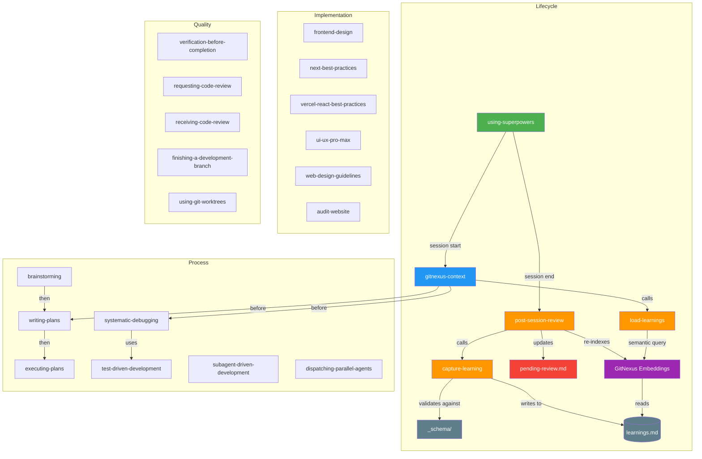

# Skills Ecosystem Map

> Auto-updated by `post-session-review`. Last update: 2026-04-10

## Skill Graph

## Skill Inventory

| Skill | Type | Learnings | Confidence avg |
|-------|------|-----------|---------------|
| using-superpowers | lifecycle | 0 | — |
| gitnexus-context | lifecycle | 0 | — |
| load-learnings | lifecycle | 0 | — |
| capture-learning | lifecycle | 0 | — |
| post-session-review | lifecycle | 0 | — |
| brainstorming | process | 0 | — |
| systematic-debugging | process | 0 | — |
| writing-plans | process | 0 | — |
| executing-plans | process | 0 | — |
| test-driven-development | process | 0 | — |
| subagent-driven-development | process | 0 | — |
| dispatching-parallel-agents | process | 0 | — |
| frontend-design | implementation | 0 | — |
| next-best-practices | implementation | 0 | — |
| vercel-react-best-practices | implementation | 0 | — |
| ui-ux-pro-max | implementation | 0 | — |
| web-design-guidelines | implementation | 0 | — |
| audit-website | implementation | 0 | — |
| verification-before-completion | quality | 0 | — |
| requesting-code-review | quality | 0 | — |
| receiving-code-review | quality | 0 | — |
| finishing-a-development-branch | quality | 0 | — |
| using-git-worktrees | quality | 0 | — |

## Learning Stats

- **Total learnings**: 0
- **Global**: 0 | **Project-specific**: 0
- **Average confidence**: —
- **Pending review**: 0
- **Deprecated**: 0
- **Semantic index**: active (embeddings enabled)
